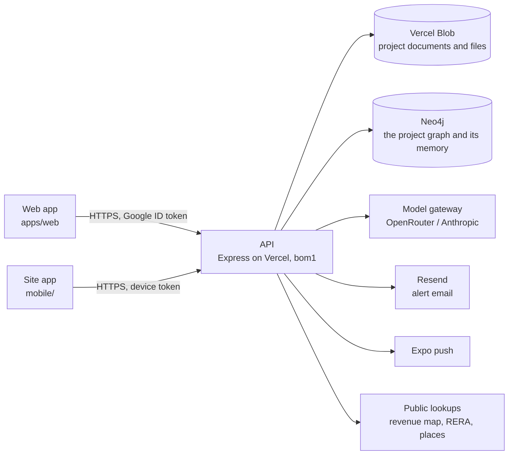

# Architecture

## The system



- **One API**, Express, deployed as a single Vercel function in Mumbai (`bom1`) and served beside the static web build. Locally the same app runs on port 5174.
- **Two stores, each doing what it is good at.** The project document store holds every record; Neo4j holds how the records connect. The graph is a projection of the store, rebuilt on every change and rebuildable from scratch, so the store is the source of truth and the graph is where connections are asked about. Neo4j also holds the project's memory, apart from the graph: see [The project's memory](#the-projects-memory).
- **The domain is pure.** Everything that is a function of a project — the stage timeline, quick assessments, the approvals register, progress, alerts, links, the graph projection — lives in `packages/shared` and runs the same in the API, the web app and the tests.

## The data model

A **project** is one JSON document (`DdProject`, `packages/shared/src/operating-model/types.ts`). It carries:

| Part | What it is | Module |
|---|---|---|
| Stage | `currentStage` (one of 12 steps) and `stageHistory` | `departments.ts` (`STAGES`, `stageTimeline`, `stageAt`) |
| Departments | `departments` (the six unless chosen), `team` (roles per department) | `departments.ts`, `team.ts` |
| Checks | assessments → scopes → checks; each check belongs to one workstream | `departments.ts` (`CHECK_WORKSTREAM`), `engagements.ts` |
| Engagements | `engagements[]`: kind, client, lead, due date, the workstreams it draws on | `engagements.ts` |
| Documents | `evidence[]`, each owned by a workstream (read from its type, or set by hand) | `vault.ts` |
| Approvals | read from the documents' types and facts against the stage | `approvals.ts` |
| Progress | `milestones[]`, `siteLog[]` (idempotent on the phone's id) | `progress.ts` |
| Quick assessments | computed per workstream, never stored | `quick-assessments.ts` |
| Certified reports | `certifiedReports[]` with a baseline snapshot and revisit flags | `certified.ts` |
| Alerts | `alerts[]`, raised and resolved by key on every save | `alerts.ts` |
| Links | system links read from the project, plus `links[]` people draw | `links.ts` |
| Review table | `reviewTable`: the questions put to the papers, a model's answers to them, the rows marked reviewed, the last run | `review-table.ts` |

**Checks live once.** An engagement draws on workstreams; it does not own checks. The checks a workstream needs are put on one internal assessment, the *project record*, the first time something needs them (`ensureWorkstreamChecks`), so the title check a lender's engagement uses is the same one the developer's screening answered.

**Quick assessments follow a source order.** Every input is labelled with where it came from, highest first: verified data on the file, the project's documents, government records and law, regulatory standards, licensed transaction data, portal listings, published sources, standard assumptions. A figure resting more than half on assumptions shows only as a rough range.

**Certified reports are the figure of record.** Filing one snapshots the quick assessment; on every save `evaluateRevisits` compares the live estimate with the certified one and flags the report for revisiting when a figure moves more than 10%, progress more than 5 points, or a new condition or blocker appears.

**A project is looked at one stage at a time.** The stage in view is not stored on the project. It is in the address, `?stage=land|pre|build|done` (`STAGE_WORD`), left out while it is the project's own stage and ignored when the word is none of the four. `ProjectCockpit` reads it and hands it to the bar, the tabs and every page. Links inside a project name no stage and are built in many places (`cockpitPath`, plain links), so the cockpit carries it instead of each link: an address that arrives without the word is looked at in the stage of the page before it and is then given the word. Going back or forward, or reloading, carries nothing, because there the address is what it was when it was left. Leaving the project drops it.

The rules are in `stage-view.ts`, on top of `departments.ts`, which says the stages each function has work in (`stages` on a workstream: the example project's list, held to the example's spec files by a test) and, more narrowly, what it delivers at each (`deliverables`). The menu follows the first. `menuAt` is a project's menu at a stage. `functionsHoldingRecords` names the functions that already hold the project's records, which `menuAt` keeps on show at the stage the project stands at; it counts what the graph draws a function's `holds`, `certifies` and `assesses` edges from, once in hand, and a test holds it against those edges. `stageInView` is the stage a page opens at: a page that is one function's opens at a stage that function shows at, the project's own first. `placeAtStage` is where the page on screen goes when another stage is picked.

## Storage

| | Locally | On Vercel |
|---|---|---|
| Workspace (tenants, members, grants, phones) | `<data dir>/v2/realytica.json` | `v2/store/realytica.json` on Blob |
| A project | `<data dir>/v2/uploads/<projectId>/project.json` | `v2/uploads/<projectId>/project.json` |
| Its files | `<data dir>/v2/uploads/<projectId>/<uuid>.<ext>` | `v2/uploads/<projectId>/…`, always private |
| A workspace's saved asks and playbooks | `<data dir>/v2/uploads/_library_<tenantId>/review-library.json` | `v2/uploads/_library_<tenantId>/review-library.json` |

`v2` is the storage generation (`REALYTICA_STORAGE_NAMESPACE`). Starting a new generation resets the data without deleting anything: the previous one stays where it was, unread, so older code finds its own data again.

Each project is written on its own and only when its `updatedAt` moved. Before the write, `store.save()` evaluates revisits and syncs alerts for the projects that changed; after it, the graph is synced and newly raised alerts are sent by email and push, and once the reply has gone the project's memory is told what the write holds.

The workspace document's `projectIds` is the index of projects. An instance adds to it the projects it created and takes out the ones it removed, and means to do nothing else: it does not take out a project it does not hold, because another instance created it since or because its document would not load. An entry can still be lost. The document is read, merged and written with nothing between, so of two instances writing it at the same moment the later write carries the list as that instance read it, without what the other added. A project lost that way is not gone: its document and files are still under `uploads/<projectId>/`. An instance that holds it keeps it, because a project is taken for removed only when its document is gone as well, and names it in the index again at its next save. So does an instance that is asked for it by id (opening `/projects/<projectId>` reads the document). A graph, its notes and the project's memory are dropped only for a project whose document is gone, and only on storage's clear answer that it is: while storage cannot say, nothing is dropped and the next save asks again.

A removal takes the documents out of storage first, and the index entry after (`removeProject`, `project-removal.ts`). While the documents are going the project is off the removing instance's list, and that instance reads none of them back onto it (`Store.takeOff`), however many requests about the project arrive meanwhile: a page left open on a project asks for it about once a second, and removing a project's files can take longer. Nor does it write one back. A save of the project that is already on its way to storage is let land before the documents are removed (`Store.written`), and a save does not begin a write of a project that has left the list since it began. So a removal does not answer that the project is gone while a write of its own is still out.

If the documents will not go, the project stays as it was and the person who asked is told. The project's own document may be among what did go, so the project is put back as unsaved and written again before the answer: kept means kept in storage too. If storage will not take that write either, the next save makes it.

Once a removal has ended, the instance lets go of the project (`Store.letGo`). Nothing in storage says a project was removed. So another instance that still holds the project, with a change it has not written, puts the document back when it saves, and the project with it. The instance that removed it then reads it from storage as it reads any other project, lists it, names it in the index at its next save, and removes it when asked a second time. The one read it does not believe is one that began before the removal ended: what that read found was a document on its way out. If the save that ends a removal fails, the instance does not let go: its next save takes the project out of the index, and until the instance is gone it does not list that project again.

Every write of a project's document carries a revision, `storeRevision` in the stored file. It is the store's own: taken off as a document is read, so no project in memory carries it and an undo cannot put an old one back. It is one more than the highest that instance has seen for the project, and never behind the clock. That guarantees a write is numbered above every copy the writing instance has read or written. It does not guarantee that the later of two writes by instances that have not read each other has the higher number: that holds only as far as their clocks agree. `updatedAt` does not order copies at all: it is the time of what was read or decided, not of the write.

The graph store is owed every copy an instance writes, and every copy it reads, at that copy's revision. It refuses a copy older than the one it holds, and for one it has already drawn it writes nothing but the revision, so being offered a project again costs one statement. A save waits, for two seconds in all (`GRAPH_WAIT_MS`), on the copies it wrote and on dropping the graphs of projects it removed. What an instance has only read it offers afterwards, with nothing waiting, which is what catches up a graph that was left behind: by a sync lost with its instance, by an outage, or by new code that draws the same record differently. A call still running when the wait ends is not abandoned. It is handed to the platform to finish after the reply, and its answer still counts. A graph store that is slow, down or failing never fails a save, and while it is down only saves ask it. When it refuses a copy that the project store still holds, which happens when the later write came from the slower clock, that copy is offered again above the number held.

## The graph

The project graph is a closed ontology (`project-ontology.ts`): six layers, a fixed set of node kinds and edge kinds, and rules for which kinds each edge may join. `buildProjectGraph` projects a project into it; `validateProjectGraph` proves the projection keeps the rules.

| Layer | Node kinds |
|---|---|
| structure | `stage`, `department`, `workstream`, `engagement`, `member`, `milestone` |
| entity | `project`, `asset`, `parcel`, `party`, `instrument`, `authority`, `encumbrance`, `approval` |
| evidence | `evidence`, `site_visit`, `sheet`, `site_entry`, `questionnaire` |
| claim | `contradiction`, `answer` |
| judgement | `assessment`, `scope`, `check`, `finding`, `risk`, `action`, `decision`, `report`, `quick_assessment`, `certified_report` |
| deliberation | `question`, `thought`, `proposal` |

The structure is the one the menu shows. Both take the five departments, the one-word names and the rule that Design sits under Engineering from `departments.ts` (`MENU_DEPARTMENTS`, `DEPARTMENT_SHORT`, `FUNCTION_SHORT`, `menuDepartment`). Both list the departments that are on with `menuDepartmentsOf` and a department's functions with `menuFunctions`, and both keep a function only while its own department is switched on, so the selector, the tabs and the graph cannot disagree about what a department holds. The graph asks for every stage at once. The menu (`rail.tsx`) passes the stage being looked at and gets the functions that show there. The graph names a workstream's function with `functionKey`.

| Node | Which ones | Id | Label |
|---|---|---|---|
| `stage` | Always four, one for each of `STAGES` | `<project>::stage::<stage key>` | Land, Pre-construction, Under construction, Completed |
| `department` | Each menu department that is switched on. Engineering is on while either `construction` or `design` is | `<project>::dept::<key>` | Legal, Finance, Engineering, Commercial, Procurement |
| `workstream` | Each function whose own department is switched on | `<project>::ws::<workstream key>`, and `<project>::ws::design` for Design | The function's one word: Title, Approvals, Valuation, Design |

The twelve finer steps are not nodes. Every stage carries `done`, `current` or `ahead` as its `status` and lists its steps in its `detail`, and the stage the project is in says first which one it is at ("At the Mobilisation step · Steps: Mobilisation, Construction, Testing & commissioning, Completion").

Design is not a department in the graph. Its four workstreams are the one function Design, under Engineering, and whatever names a design workstream (a check, a link, an engagement, a certified report) is joined to that one node, once. A role in Design is not a role in Engineering. It is said on the person ("Signer, Design") and draws no edge to a department, so Design's signer is never named as answering for Engineering's work. A person whose only role is in Design is tied to the project like any other record nothing places. When only Design is switched on, the Engineering node stands for Design alone: it is described as Design is and its `status` is `coming_soon`, taken from the functions drawn under it.

A function node keeps the kind `workstream`. The names the frame no longer draws are kept in the `detail` of what stands for them, which is what a search reads: a step on its stage, a department's name in full on the department ("Legal & Compliance", and "Engineering & Construction", so "Construction" finds Engineering), a function's name in full where it differs from its one word ("land records" finds Title), and Design's four workstreams on Design. `findProjectNodes` also answers to "function" and "functions" for the kind. Two functions share the word Handover, so wherever functions are named side by side the department is said with it ("Legal › Handover"; `withDepartment`).

The structural edges:

| Edge | From → to |
|---|---|
| `at_stage`, `precedes`, `in_stage` | project → the stage it is at; stage → the next; a record → the stage it arrived in |
| `has_department`, `has_workstream` | project → department → function |
| `holds` | function → a check, document, approval, milestone, visit, site entry or questionnaire |
| `gates`, `feeds` | approval or function → the function that cannot go ahead without it; function → one whose estimate it moves |
| `draws_on`, `delivers` | engagement → function; engagement → report |
| `assesses`, `certifies` | quick assessment → function; certified report → function |
| `leads`, `contributes_to`, `signs_for`, `views` | member → department |
| `advances` | site entry → the milestone it moved |
| `relates` | anything a person said belongs together |
| `has_record` | project → a record nothing else places |

…beside the register edges that were already there (`has_scope`, `has_check`, `supported_by`, `produces`, `raises`, `requires`, `affects`, `encumbers`, the title chain and so on).

**Nothing floats.** Every node can be reached from the project. Once the registers are written, the builder walks out from the project and ties to it whatever the walk did not arrive at. Where the kind has a relation of its own that is true of an unplaced record, it uses that (`has_risk`, `has_asset`, `reported_in`). Otherwise it uses `has_record`. That covers an action or a document that names nothing else on the file, a finding or a decision that has no date to place it in a stage, an approval or a milestone whose function is switched off, a person with no role in a department that is drawn, and a parcel or a party that only a title chain names. The last two are not tied with `sited_at` or `engaged_on`: on a file that declares no land of its own, the chain says the deeds name that parcel, not that the project stands on it.

Three limits on the tie. A record the project already reaches never gets it. Records joined only to each other get one between them, on whichever was written first. Talk does not count as placing a record: an edge that starts at a question, a thought or a proposal is left out of the walk, so a record keeps its tie when a chat turn cites it and the tie does not come and go as turns leave the window.

**Relations in plain words.** `PROJECT_EDGE_LABEL` gives every edge kind a phrase for each direction: "rests on" and "supports" for `supported_by`, "holds" and "is held by" for `holds`. It is a `Record` over the kind, so a relation cannot be added without its words. A phrase has to be true in every state the edge is drawn in, so `gates` reads "is needed before" and "cannot go ahead without", which holds for an approval that is missing. Three relations are drawn to a paper whether or not it has arrived (`supported_by`, `holds`, `has_record`), and no single phrase is true of both states. They have a second pair in `PROJECT_EDGE_LABEL_AWAITED`, "still needs" and "is still needed by", used when the record the edge reaches is a document that is expected, requested or missing, or an approval with nothing on file (`projectNodeAwaited`; a document's standing is its node's `status`). A document that was superseded or rejected is on file and not relied on, so `supported_by` and `holds` have a third pair in `PROJECT_EDGE_LABEL_SET_ASIDE`: "cited" and "was cited by", "keeps on file" and "is kept on file by" (`projectNodeSetAside`). `projectEdgePhrase` picks among the three. The Graph page, the title chain diagram and the neighbourhood handed to the copilot all read links with these words, never the key. The Graph page groups the links by the kind of thing at the other end, with documents, site visits, site entries and sheets first and no kind left out.

**Links drawn by hand.** `linkEdge` says which edge a link is drawn as, and `addLink` refuses a link whose edge the endpoint rules do not allow (a check cannot gate a function), naming `relates` as the way to say two things belong together. The system's own links all pass the same check.

### In Neo4j

Every node is `(:Ryt {id, projectId, kind, layer, origin, label, detail, key, status})` with its kind, layer and origin as extra labels; every edge is one relationship type, `[:RYT_EDGE {id, projectId, kind, origin, closedAt}]`, with the kind as an indexed property so a query is never built by interpolating a type. A sync replaces the project's derived nodes and *closes* edges it no longer draws rather than deleting them, so "what did this rest on in March" stays answerable. Constraints: unique `id`; indexes on `projectId`, `kind`, `origin`, `key`, edge `kind` and `closedAt` (`ensureNeo4jSchema`).

One node a project is not part of the graph: `(:GraphSync {projectId, revision, drawing, asked})`, unique by `projectId`, holding the revision of the project copy the stored graph was built from and a digest of what was drawn. A sync takes it first, in the transaction that writes. It writes nothing if its own revision is lower, so an instance holding an older copy cannot delete what a newer copy drew, and nothing but the marker if its drawing is the one stored. Otherwise it is five statements, whatever the project holds: the marker, the nodes with their labels, the edges, the nodes to remove and the edges to close. Two syncs of one project wait for each other on the marker. No statement that reads or rebuilds the graph matches it, and a purge removes it with the project's nodes. Every write is given ten seconds by the database, after which it is ended.

The marker says what the graph draws only among builds that keep it. A build that predates it rewrites or purges the graph and leaves the marker saying what it said, and a later revision does not by itself put that right, because a copy that draws what the marker names writes nothing. So a copy counts as drawn only if the project also holds as many derived nodes as the copy draws, which notices a purge and a redraw to a different number of nodes. A redraw to the same number of nodes stays until the drawing next changes. The local journal keeps no note of the drawing: it compares a copy with what it holds.

What a change reaches — the question behind the Connections panel and an expiring approval's alert — is a walk (`graph/neo4j.ts`, `impact`):

```cypher
// From a record to the functions it sits in, then on along gates and feeds.
MATCH (x:Ryt {projectId: $p, id: $id})
OPTIONAL MATCH (d:Ryt {projectId: $p})-[r:RYT_EDGE]->(x) WHERE r.kind IN ['supported_by','advances'] AND r.closedAt IS NULL
WITH x, [x] + collect(DISTINCT d) AS seeds
UNWIND seeds AS s
OPTIONAL MATCH (w:Ryt {projectId: $p})-[h:RYT_EDGE]->(s) WHERE w.kind = 'workstream' AND h.kind = 'holds' AND h.closedAt IS NULL
WITH seeds, collect(DISTINCT w) + [s IN seeds WHERE s.kind = 'workstream'] AS home
UNWIND home + [s IN seeds WHERE s.kind = 'approval'] AS start
MATCH p = (start)-[:RYT_EDGE*1..3]->(down:Ryt {projectId: $p, kind: 'workstream'})
WHERE all(r IN relationships(p) WHERE r.kind IN ['gates','feeds'] AND r.closedAt IS NULL)
RETURN down.label, length(p)
```

A second read finds the engagements, certified reports, quick assessments and the leads and signers standing on every function touched. The walk goes by kind and relation and never by id, so it needs no change when the frame does. The same walk runs over a snapshot in `graph-impact.ts`, for the local journal and as the fallback when Neo4j does not answer.

Useful queries:

```cypher
// Everything Legal holds on one project
MATCH (:Ryt {projectId: $p, kind: 'department', key: 'legal'})-[:RYT_EDGE {kind: 'has_workstream'}]->(w)-[h:RYT_EDGE {kind: 'holds'}]->(x)
WHERE h.closedAt IS NULL RETURN w.label, x.kind, x.label

// What arrived while the project was Under construction (a stage's key is its own: `construction` is the stage)
MATCH (x:Ryt {projectId: $p})-[r:RYT_EDGE {kind: 'in_stage'}]->(:stage {projectId: $p, key: 'construction'})
WHERE r.closedAt IS NULL RETURN x.kind, x.label

// Who answers for a function now (without the two `closedAt` tests it also returns people who used to)
MATCH (m:member {projectId: $p})-[r:RYT_EDGE]->(:department)-[f:RYT_EDGE {kind: 'has_workstream'}]->(w {key: 'finance.valuation'})
WHERE r.kind IN ['leads','signs_for'] AND r.closedAt IS NULL AND f.closedAt IS NULL RETURN m.label, r.kind

// The records nothing but the project places. Some are in hand and some are still needed: x.status says which
MATCH (:project {projectId: $p})-[r:RYT_EDGE {kind: 'has_record'}]->(x)
WHERE r.closedAt IS NULL RETURN x.kind, x.label, x.status
```

## The project's memory

Memory is kept in the graph store, beside the graph and apart from it. The graph is a drawing of the record as it stands now. Memory is what the project has been told, and a redraw does not touch it. It holds three things. An **entry** for every event that changes what a project knows. A **fact** for every value the record holds, tagged with where it stands: `approved` when a person typed or accepted it, `proposed` while it waits. And the assistant's own **notes**, facts tagged `thought`, each on the page memory keeps for what it is about. Entries and the first two kinds of fact are told from the record and can be told again. Notes cannot.

**What is told.** `memoryDelta` (`packages/shared/src/operating-model/mem-delta.ts`) turns a project's record into entries. It is pure and shared, so every build gives the same event the same id.

| Entry | Told from |
|---|---|
| `paper_filed`, `file_added` | the audit event of a paper's filing, and of a file added to it |
| `paper_read` | the audit event of the reading (`read`). A paper read before the record wrote readings down is told once, with its filing |
| `value_accepted`, `value_corrected`, `value_set_aside`, `value_reopened` | the audit event of the decision |
| `chat_asked`, `chat_answered` | the turn in the conversation |
| `edit_noted` | the note a work-pane write leaves in the conversation: its two turns, as one entry |
| `decision_recorded`, `action_recorded`, `finding_raised` | the audit event that created the record |
| `action_closed`, `decision_settled` | the audit event of the change of standing (`status_change`): an action set to closed, and a decision that was proposed, pending or deferred set to approved, rejected, conditional or implemented. No other change of standing is told, and no word of the standing is kept |
| `meeting_kept` | the audit event of a meeting's notes being kept. It points at the meeting and holds none of the notes |
| `report_issued` | the audit event of a report being issued under a name. A report made or edited is not told |
| `map_read_kept`, `map_read_removed` | the audit event of a read of the public map kept or taken off |
| `undone` | the audit event of an undo, and the records it put something back on. The events of what was put back stay, and this says they no longer stand |

Two of these have no audit event. A chat turn and a work-pane note are told from the conversation, which is why memory keeps a second watermark. A value proposed and not yet decided has no event either: it is no entry, and it is a fact (below). Every other audit event is passed over.

A chat turn is told once it has its author. A request writes its turns, may save the project while it waits on a model, and names who asked and on which page only when the answer is back. So a turn with no author waits, and every turn after it waits behind it. One still unnamed after fifteen minutes (`MEM_TURN_WAIT_MS`) is told as nobody's: no request runs that long.

A work-pane note does not wait. A write made on a work pane leaves a line in the conversation and a one-word reply (`noteProjectEdit`), written whole, and nothing comes back to name them. The pair is one entry, told from the line, at once: its author's when the write names one, and nobody's when it does not. The reply's `pane_write` tool call is what tells a note from a question still waiting for its answer.

**What an entry holds.** Its `id` (the project's id, `::mem::`, then the id of what told it), `kind`, `at`, `by`, `sourceId`, and `about`: the ids of the records it is about. An entry holds no words of the record's, with one exception: a map read points at its parcel by the key the record keeps the read under (`kgis:<village code>:<survey number>`, or `ulb:` or `rural:` and a number), which names land and no person. It is kept only in that fixed form, the map reader's own (`MEM_PARCEL_REF`), and a map read points at nothing else. An entry about a value carries the value's `key`, which the audit event names (`factKey`), and, as its `label`, the name the rules' own lists give that key (`STANDARD_FACT_KEYS`, `RULES_FACT_KEYS`); a value under a key that is on neither is told with neither. A chat turn carries the page it was asked on, in the menu's own words. `by` is not an email. It is an id made from the project and the person, the same for one person on one project and different on another. An id the graph makes from words on the record is kept the same way, as a token for the words (`memPointer`): a person's node carries their email, and a node of the title chain carries a name or a number read off a paper. `writeMemory` (`graph/mem/write.ts`) is the one way into memory, and it passes every entry through `scrubMemEntry`: an entry's own properties are kept and nothing else, a label is never taken from the caller, and a place is the product's own words or nothing. Titles are looked up when memory is read, on the record as it stands then.

**The facts.** `memoryFacts` (`mem-facts.ts`) turns the record as it stands into facts. A fact is one slot: one value, for one key, about one thing on the record. Its id is the project's id, `::fact::`, then the slot, so the same slot is always the same fact, whatever its value becomes.

| Fact | Tag | Told from |
|---|---|---|
| a value a person accepted on a paper | `approved`, with who and when | the row's own `decidedBy`, and its past from the audit trail |
| a value read off a paper and not decided | `proposed`, with who read it (`rules`, `model`) and its proof | the row. Whether it stands is asked of the record's own rule (`standingFacts`) when the fact is told |
| the same value read two ways | two `proposed` facts that name each other | the row's reading and the other reader's |
| what a paper is | `approved` where the trail says a person confirmed or corrected it. Otherwise `proposed`: the rules' reading, which stands, where the row was read and nobody has said, and a model's offer, which does not | the row and the trail (`type_confirmed`, `type_corrected`, `type_refused`) |
| a field recorded on a check, and its result | `approved` | the check's own record of who recorded it, and the trail |
| the project's own fields, and its stage | `approved` | the project, with who from `valueSources` or the change on the trail that names the field (`fields`) |
| a comparable accepted, a question answered, a decision, an action, a map read kept | `approved` (a model's suggested answer is `proposed`) | the record. A decision or an action made from a meeting's notes names the meeting as its `source`, with the words of the notes it rests on |
| a value waiting on a card raised in chat | `proposed`, read by `card` | the card |

A value set aside has no fact: its slot is empty, and the entry of its setting aside remains. A fact carries its `key` and the list's `label` for it, the value with its unit and display, what it is `about` and its place in the menu, when it is true of the world (`validFrom`, `validTo`), when the record came to hold it, its `source` with page and the few words that are its proof, and its past: up to six lines of what was accepted, corrected, set aside or reopened, newest first (`was`).

What a fact may hold is decided by what the fact is and not by looking for bad words. Its key is on a fixed list: the rules' two, the fields of the record (`MEM_FIELD_KEYS`), or a field of the check catalogue. Its label is that list's. Its value is in the form the list gives the key: a date, a number, yes or no, one of a few words, or a line. A line is one line of at most 160 characters with no address for mail in it, no permanent account number, and no run of nine digits or more, which is what an identity number, a phone number and a bank account are made of. A value that is not that is left out and counted, and the read route says how many (`withheld`). A person's name is kept. `scrubMemFact` holds a fact to this where it is told and again in `writeMemory`.

Memory is brought to the record's facts by difference. `factsRev` is one digest of every fact told from the record, kept on the project's memory node and checked in the write. A pass that finds it differs reads the id and digest of each fact memory holds (`factIndex`), writes the facts that differ and lets go of the ones the record no longer gives (`memFactsDiff`), at most 500 facts a write. A fact found is replaced property for property. So telling a record step by step and telling it once from nothing leave the same facts, which a test runs both ways over random sequences of changes.

**The assistant's notes.** A reply may end with one line, `Note to memory: …`, which the chat takes off the reply before anybody reads it (`memNoteOfReply`), so a note costs no second call to a model. Only the reply's last line can be the note, and not when it stands behind a quote mark or in a block of code: a line in that form anywhere else may be a paper's words the reply quotes, and stays the reply's text. It is kept after the reply, for the firm's own people's chats only, as a fact tagged `thought` (`memThought`, `graph/mem/thought.ts`): the sentence, what it is about, the page it was left on, and the reply it came from. A note is filed under the record it names only when the reply had to do with that record, which is the check the sitting is on or a record the reply cited by id or through a memory line; a note that names any other record is filed under the project, and one that names nothing under the sitting's check, the one record the reply cited, or the project (`memThoughtAbout`). The tag is set by code. A note is one line of at most 400 characters and is scrubbed as any fact is. Its id is under a heading of its own (`::thought::`) that no fact told from the record can have, and a store writes one only through its own door (`think`), so nothing told from the record writes over a note and a note never becomes approved or proposed by itself. A project keeps its newest 300. A note is the one thing memory holds that the record cannot tell again: a start-over leaves it, a project that is removed takes it, and a memory store that is lost has lost it.

**In Neo4j.** One `(:MemProject {id, projectId, tenantId, schema, auditThrough, turnThrough, factsRev, live, asked, writtenAt})` a project, with the id `<projectId>::mem`, one `(:MemEntry {id, projectId, tenantId, kind, at, by, sourceId, about, key, label, pane, department, fn, stage})` an event, one `(:MemFact {id, projectId, tenantId, tag, key, label, value, unit, display, aboutId, department, fn, validFrom, validTo, recordedAt, by, at, readBy, proof, stands, source, page, quote, contests, was, rev})` a slot or a note, and one `(:MemPage {id, projectId, tenantId, aboutId})` for each thing a note is about, joined to its notes by `(:MemFact)-[:MEM_ON]->(:MemPage)`. `id` is unique for each label and `projectId` is indexed on entries, facts and pages; the memory store makes these before its first write, not at boot. No statement of memory's names `Ryt`, `RYT_EDGE` or `GraphSync`, and the one relationship made is `MEM_ON`, between two of memory's own nodes: an entry and a fact point at the record by ids they hold as properties, because a relationship to a graph node would go the first time a build redrew the project without that node. A build that knows only the graph therefore syncs and purges without meeting a memory node. Every write is given ten seconds by the database and every read five. Locally memory is a file of its own, `project-memory-journal.json`, beside the graph's journal.

**How it is written.** Each instance owes memory every copy of a project it writes and every copy it reads. A pass tells what is owed once the reply has gone (`remember` in `store.ts`, kept alive by the platform), for two seconds at a time (`MEMORY_WAIT_MS`), and only from a copy as the project store holds it. A write is one transaction. It takes the project's `MemProject` node and writes to it before reading it, so two writers of one project's memory go one after the other. It then writes nothing if the writer may not write over what memory holds (see the shape, below), and nothing if memory does not stand where the writer believed, answering where it does stand so the writer can ask again. A write that is turned away ends with nothing written, not even the node it took. Otherwise the entries, the facts and the watermark go in together. An entry is created and never changed, and its project is set when it is made and never after. The one thing that changes an entry is a write that starts the project's memory over, which lets every entry go and tells them again. A fact is what the record holds now, so one written again replaces what its node held. So a write that fails leaves memory where it stood, the next save or read of the project on any instance tells the same events again, and an entry told twice is one entry. One write tells at most 500 events (`MEM_AT_MOST`); a longer record takes several.

A copy of the project that does not hold the event or the turn the watermark names tells nothing: it is an older copy. Unless the project store still holds that very copy. Then it is the record that lost the event, because the last of two writers of one project keeps its copy, and everything the record holds now is told (`memoryReplay`). Memory keeps the entry of an audit event the record lost. Chats are the exception: when it is the turn the record has lost, which is what deleting the chats does, the entries told from the conversation are let go in the same write, and only the turns the record holds now are told.

A conversation is told from its start only by the copy the project store holds. After the chats are deleted memory stands at no turn, exactly as it does for a conversation never told, and an instance that read the project before the deletion still holds the turns. So before a pass tells turns from the start it asks the project store whether it still holds that copy (one read of the project's document), and an older copy tells nothing.

A failure is logged once a pass and never fails a save. While the memory store fails every call, only saves ask it.

**The shape, and who may write over it.** `MEM_SCHEMA` is the shape a build writes, raised with every change to what an entry holds or to which events are told (a test pins the shape to the schema). It is 5: facts since 3, with 4 a meeting kept and a report issued are told, and with 5 an action closed and a decision settled. A project's memory says which shape it is in and whether the live site wrote it: `live` on its `MemProject` node, set by the live site's own write and by no other, and never taken off. The live site is the deployment Vercel runs as production: named production, at the address Vercel serves it from (`memWriter`, `graph/mem/write.ts`). A preview is not, and neither is a laptop, a test or the probe, though any of them may be pointed at the live site's database, and though a machine may hold production's settings.

The rule is `shapeRule` (`graph/mem/types.ts`), kept by both stores inside the write:

| The writer | Memory the live site has not written | Memory the live site wrote |
|---|---|---|
| Not the live site, same shape | carries on | carries on |
| Not the live site, memory in an earlier shape | starts it over | is turned away, and says so once in its log |
| Not the live site, memory in a later shape | stands down | stands down |
| The live site, same shape | starts it over | carries on |
| The live site, memory in an earlier shape | starts it over | starts it over |
| The live site, memory in a later shape | starts it over | stands down: a later live build wrote it |

Starting over is one write: every entry and every fact told from the record is let go, the project's own node is made again, and the record is told from its first event in the writer's shape. That is what happens to entries written in an earlier shape: they are neither left nor rewritten, they go, and every event is told again, so no entry stays as an earlier rule wrote it. A record longer than one write is told over several, the first of which starts over and the rest carry on. Starting over costs nothing for what the record can tell again. The assistant's notes and their pages are not that, and a start-over leaves them where they are. A writer the rule turns away, or one that stands down, adds no note either.

So until the live site writes a project's memory, that memory is the previews': the latest shape among them holds it, and a branch that changes the shape can be tried on its preview against the shared database. The first write the live site makes to a project trusts nothing a preview left, whatever its shape, and from then on only the live site raises that project's shape. Nothing a preview writes makes the live site stand down. The pass works the rule out first from where it last knew memory to stand, so a deployment that is turned away makes no write; and it does not keep that answer, so it writes again as soon as the live site has raised the shape. Being turned away and standing down are each said once in the log and are not failures. Standing down has no end of its own: a deployment writes nothing for a project whose memory is in a later shape until a deployment in that shape is the one running, which is also what happens to a live site put back to an earlier build. A preview's graph stays detached, as `graph/preview.ts` has it.

**Room.** A database with an allowance of nodes counts the graph's and memory's together. Memory is one node an event, one node a slot the record fills, however often its value changed, and at most 300 notes a project with a page for each thing they are about. So facts stop growing at the size of the record, and entries are what grow. The read route below counts the nodes of a project's memory and, for the workspace's admins, every node in the database, so the number can be watched. When the database turns a write of memory away for want of room, that is said once in the log and nothing more is written until a write is taken again; only saves ask in the meantime. The graph is offered apart from memory and goes on being drawn for as long as it has room itself. Nothing is pruned yet.

**A project that is gone** takes its memory with it: removing a project removes every `Mem` node of it, as soon as its documents are gone. `removeProject` (`project-removal.ts`) removes the documents first and, when they will not go, leaves the project as it was and says so; see the project store, above. A build that knows nothing of memory leaves the nodes behind. So an instance looks, at most once a minute, for memory in the workspaces its project store holds whose project it does not hold and whose document is gone from storage, and removes what it has seen gone on two looks. A machine pointed at this database with a copy of this project store would take projects made since the copy for gone. What it removed would be told again from the record at the project's next save, all but the assistant's notes, which would be lost.

**Reading it.** `GET /api/projects/:projectId/memory?limit=` answers the firm's own people with the entries newest first, each with `about` resolved to the titles the record has now and `by` to the person the record names (`graph/mem/read.ts`, `routes/project-memory.ts`). With them, `facts`: every fact memory holds with its tag, who approved it or who read it and whether it stands, what it is about and what states it by title, its dates and its past, the notes among them; `withheld`: how many values the record holds that were not made facts, and why; and `pages`: each thing with a note on it, with how many. With them, `nodes.project`: how many nodes the project's memory is. And for an admin of the workspace, `nodes.database`: every node the database holds, which is every workspace's and so is shown to nobody else. A count that fails is left out of the answer and logged; it does not fail the read. A token is resolved by making the same token from each id the record holds.

**What looks wrong.** `GET /api/projects/:projectId/memory/lint` reads memory against itself and against the record (`memLint`, `mem-lint.ts`) and lists, gravest first: two approved facts of the same thing that differ; a waiting value that differs from the approved one; an approved fact the record no longer gives; memory behind the record; a fact or a note about a record that is gone; an approved value on the project or a check with no paper behind it; and a value that has waited fourteen days or more. Two facts are of the same thing when they have the same key and share what they are about or what states them. It lists and changes nothing. Asked in the chat what looks wrong in memory, the chat answers with one line made from the same list, and no model words it.

**In the chat.** A question brings lines from memory with it (`memContext`, `mem-context.ts`; `graph/mem/context.ts`). It has at most five seeds: the page it was asked on, the record the sitting is on, the records it names by title and the kinds of value it names by label, or the project itself where there is none of these. A seed brings at most eight facts, a person's word before a reading, of which at most two are notes, and a question at most forty. Each is one line: a mark, the tag, what it says, what states it and its date, and what it was before only when the question is about change. The store is given 400 milliseconds, and is believed only when the digest it holds is the record's own. Otherwise the lines are told from the record, which is always current, and the store still gives its notes. A store that did not answer in time is left alone for a minute, unless its answer then comes late, as it does on the first call of a new instance. Somebody working from a grant is told from their own copy of the record and is never shown memory or a note.

The answer cites a line by its mark, and code prints the tag where the mark stood (`memTagsPrinted`): `[approved]`, `[waiting]`, `[waiting · stands]` or `[thought]`. Before that, everything the model wrote that reads as a tag, and every mark that names no line, is taken out, again and again until the text stops changing, so that pieces which close up into a tag go too. The tags are printed last, on the words as they are kept, and the turn keeps the facts it rests on with the place of each tag in its text (`restsOn`, each with `at`). The page draws a tag only at those places, and only where the text there is that fact's own tag (`answer-blocks.ts`): it never reads a tag out of the text, so no words a model writes can be drawn as one. The check on an answer's figures reads the record and no memory, so a figure only a note gives is marked as one the file does not support.

**An answer the chat gives by rule** reads the record and says nothing of what waits: asked the land area, it gives the one on the project and not the other one waiting on a card. So where such an answer leaves the chat route, the facts memory holds that the question is about are said under it by code (`memUnderAnswer`, `mem-answer.ts`; `sayWhereItStands`), each in one line with its tag, who approved it or how it was read, when, and what states it: at most four, what waits first, and nothing where memory holds nothing about the question. About the question means the closest thing it is about that memory holds anything of: what it names, else the record the sitting is on, else the page. A question about the project as a whole, or an answer that is one (where it stands, what comes next), brings what waits anywhere on the project and then the newest a named person approved. Not under a reply that carried out an instruction, asked a question back, opened a page or filed papers. The turn keeps `restsOn` as a model's answer does. The lines are told from the record, which is what memory holds whenever it is not behind, and the store is asked only for its notes, and only when there is room under the answer for one.

**A question put to memory itself** is answered from memory by rule (`memAsksMemory`, `memAnswer`), and is looked for before every rule that reads a value off the file: what memory holds or what is known about something, what was agreed or decided about it, what is still undecided, what changed. What it is about is the words after "about" where the question has them, and otherwise what the question names: a record by its title, a paper by its kind, a kind of value by its label or by a common word for it (the seller is the vendor), a page of the menu by its name, or the project. Where no record goes by those words, a decision or an action whose own title has every one that tells is still about them, and "the meeting of 3 October" or "the last meeting" is the decisions and actions made from that meeting's notes. The answer lists the facts about it with tag, who and when, in the order the question wants them, and for a question about change what each was before. Then the decisions and actions about it, each with where the record says it stands, and one that came out of a meeting with the meeting and a mark that opens its notes at the words it rests on. Then the assistant's notes about it, set apart and said not to be facts of the file. A question that names nothing memory can find is answered in one line. No model words any of it.

## Sign-in and access

- **People** sign in with Google; the API verifies the ID token itself (`auth/verify.ts`). The first allowed address to sign in to an empty workspace owns it. See [auth.md](auth.md).
- **Phones** pair with a code a signed-in person makes (`POST /api/devices/pair-code`, 8 characters, 10 minutes, one use). The phone trades it for a token of its own (`rdt_…`), stored only as a hash, which resolves to that person on every call, reaches only the site routes, and stops working when the phone is revoked or the person leaves.
- **Departments decide what a person may do.** A firm role sets the default (owners and managers lead, staff contribute, viewers read); the project's team list overrides it per department. Someone outside the firm reaches only the departments given to them, written as a grant the response redaction already understands.

## Documents

A document is filed once, in the vault, and owned by the workstream it belongs to. Reading happens in two passes:

1. **Locally**, always: the text layer, then OCR (English and Kannada, bundled) for scanned pages; the reader recognises the document type and lifts its facts with the words and page they came from (`document-parse.ts`).
2. **By a model**, when one is configured, for what the local reader could not make out. A PDF too long or too heavy to send whole is sent as a window — its first pages and its last, as many as fit — and every cited page is mapped back to the original.

Files larger than one serverless request (4.5 MB) go up in 4 MB parts (`POST /uploads`, `PUT /uploads/:id/parts/:n`, `POST /uploads/:id/complete`) and are assembled in storage.

## Meetings

The notes of a meeting are kept on the file as a meeting (`packages/shared/src/operating-model/meetings.ts`, `apps/api/src/meetings.ts`). They arrive pasted into the chat as a message or dropped as a file. A meeting on the record (`project.meetings`) holds the day it was held, who was there, where the words are kept and what was proposed from them. It never holds the words. They are a file in the project's storage: pasted notes are written there as a text file and the thread keeps one line in their place ("Notes of a meeting pasted, about 3,200 words"), and a dropped file is already there, with the text read off it kept beside it. A message is 4,000 characters at most; only notes of a meeting may be longer, up to 20,000, because they are not kept in the thread.

**Whether words are notes** is read from how they are laid out (`meetingNotesSeen`): a heading that says so, a line of who was there, a date, lines marked as decisions and actions. Notes are not filed on the register of documents and nothing reads them for a survey number. Where it cannot be told, and for the minutes of a company's board or a society's general body, which may be a paper of title, the chat holds the words and asks, with two choices. Nothing is kept as a meeting or filed as a paper until a person says. A file a person says is a document goes down the path every dropped document takes; words that are neither are deleted. A file already on the register is never taken for notes (`meetingNotesFor`). One the rules read as a paper is a paper, unless it is laid out as notes: notes about a property use a paper's own words, so the rules may read them as that paper, and then the two readings disagree and the chat asks.

**What the notes say** is read as three things: what was decided, what is to be done with who and by when, and what was left open. By rule where the notes mark their lines ("Decision:", "Action: … by Friday", "Open:", or a heading of those words), and by a model where one is set up (`readMeetingNotesByModel`), whose reading is held to the notes' own words (`meetingItemsHeld`): an item is kept only when the words it quotes are in the notes, a name only when those quoted words have it, and a date is read from those words by rule and never taken from the model. A weekday or a day with no year is read from the day the meeting was held, and is left empty when the notes do not say when that was. Nothing is guessed from today's date.

**Nothing read from notes is on the record.** Each item waits on a card with the words it came from. Accepted, a decision and an action are the records the project already has for them (`DecisionRecord`, `ActionRecord`). A point left open is a decision nobody has made: a decision record that stands as pending, which is where "what is still undecided" looks. A meeting knows the card it raised for each item, and through the card the record made of it (`meetingOfRecord`), so nothing new is kept on a decision or an action. From either, on its register and in an answer of the chat, a person opens the notes at the words it rests on (`GET /api/projects/:projectId/meetings/:meetingId/notes`, for the firm's own people). "What meetings were held" lists them in the chat, each with a way to open its notes.

**An action past its date** raises the alert a project already has for things that lapse (`actionsPastDue`, `alerts.ts`): once for that date, to the lead of the department it belongs to and to the person the action is on, when that name is one person among those who may be told (`alertNamed`, `notify.ts`). Nobody is mailed or pushed what they could not read in the app (`mayHear`): the firm's own people are told of any alert, and somebody working from a grant only of one their own copy of the project holds. That copy keeps an alert only where its own records raise it, worded from those records, so an alert about an action, a paper or a meeting withheld from them is not in it (`alertsOfCopy`, `projectView`). Where two people go by the name on an action, nobody is sent it by name. It clears when the action is closed, on the Risks and actions page or by telling the chat to close it. Alerts are worked out when a project is saved. Nothing runs on a schedule, so an action whose date passes on a day nobody touches the project raises its alert at the next save.

## The review table

A project's papers as rows and questions as columns, at `/projects/<id>/review` (`packages/shared/src/operating-model/review-table.ts`, `apps/api/src/routes/review-table.ts`). The rows are the papers on the file, chosen by kind of paper, by function or one by one; the choice is in the address (`?kind=`, `?fn=`, `?paper=`) and is not stored. The table is on the record as `project.reviewTable`, every part of it optional.

**A column is one of two things.** A listed value is a key from the rules' two fixed lists (`STANDARD_FACT_KEYS`, `RULES_FACT_KEYS`). Its cell is what the paper's row holds under that key, with its page, its words and where it stands: approved only where `stands` says a person's acceptance holds on that paper, waiting, or set aside. No model is asked for it, and a column is drawn only for the kinds of paper that carry its key (`paperCarries`). A question in words is answered for each paper from the page text kept beside its file (`loadPageTexts`), by a model where one is set up (`answerPaperQuestions`, `packages/agents/src/agents/review-answers.ts`). The model is sent words and never the file, every question for one paper in one call. Where no model is set up the pages are searched for the question's words (`searchPagesFor`), and the cell offers the passage found with its page and says a search found it.

**A model's answer is not a value of the paper.** It is kept in `reviewTable.answers`, by column and by paper, and nothing writes it to a row's `facts`, so nothing that acts on a value can read it. It is held to the page before it is kept: its words are looked for among the pages that were sent, by the reader's own rule for whether a page holds a quote (`findQuoteInPages`), and every number the answer writes has to be a number those words write (`numbersIn`). An answer that passes both rests on the page's text. One that fails either is kept as unverified and drawn as that. An answer says when its page's words are OCR's reading of a scan. An answer from an earlier file of the paper is not shown: it says nothing of the paper as it is now.

**A run** is started by a person, for the papers on screen, after the page has said how many papers and questions it is. It answers at most 25 papers (`REVIEW_RUN_PAPERS`); the rest wait for the next. The page drives it, one paper a request (`POST /review/runs/:runId/papers/:evidenceId`), and each request saves before it answers, so a row is drawn as it lands, a dropped connection loses nothing, and a run stops when the page stops asking. A paper that is not in a started run is not answered. The trail keeps a line for a run (`review_run`), for one stopped (`review_run_stopped`), and for a row marked reviewed or unmarked (`review_row_reviewed`, `review_row_unmarked`). The table leaves as CSV or as an Excel workbook (`exceljs`, loaded only when a file is asked for), every cell a string, so what a paper states is shown and never run as a formula.

**Saved asks and playbooks** are the workspace's, not a project's. A saved ask is one question; a playbook is a named set of columns for a kind of paper. They are kept in one document of their own in storage, beside the projects' folders and inside none of them, and not in the workspace document, which is read on every request. `GET /api/libraries/review` lists them for the firm's own people; somebody working from a grant on one project is answered as if there were none, and their copy of a project carries no review table (`projectView`). Anybody of the firm's own who may change a record saves one, the person who saved it or an owner or manager changes or removes it, and everybody else runs it (`mayAddToReviewLibrary`, `mayChangeReviewLibraryItem`). Run on a project, its columns go on that project's table for the papers of its kind. Run on one paper, they are asked of that paper whatever its kind.

## The status report

"Write this week's status for the owner" in the chat writes a status report (`packages/shared/src/operating-model/status-report.ts`): what changed over a period, what is waiting and on whom, and what comes next. The period is the week so far unless the sentence names one: last week, this month or last, a month by its name, "since 1 October", "since Monday", "the last 10 days", or "since the last report", which starts where the last status report that was issued ended.

**It is made by code from what memory is told and holds.** `statusReport` reads memory's entries in the period (`memoryDelta`) and its facts (`memoryFacts`), each with the record it is about as that record stands now, and no model writes a line. So the same record gives the same report twice. What changed is one line a paper (filed, read, values accepted, and for an approval where it stands), a decision recorded or settled, an action closed, an action whose date passed in the period, an approval that lapsed in it, a finding raised, a meeting's notes kept and a report issued. What waits and what comes next are told as of now, because the record keeps what waits now and not what waited on an earlier day: overdue and undated actions, decisions still to be made, cards and values nobody has accepted, papers asked for; then actions due, approvals running out, papers promised and milestones planned, by date.

**Every line has something behind it** and says so in two columns: where it stands, in the record's own word, and what is behind it, by title, with the record's id on the row so it opens from the report. A line that rests only on something nobody has accepted, values read off a paper or things waiting on cards, says that in its own words and stands as waiting. An event whose record has since gone is left out.

**It is a report among the project's reports**, of kind `status`: three sections bound to the record (`status_changed`, `status_waiting`, `status_next`, each with the period as `from` and `to`), read live until a person issues the report under their name, and printed and exported as every other report is. The instruction is the person's own, so the draft is written at once, and it is listed under the reply as what that message changed, where it can be undone. The chat says it short, with a link that opens it. Asked for again for the same period and reader, the draft already there is brought up to now and no second one is made. A period nothing happened in gets one line in the chat and no report.

**A model may reword the lines** where one is set up (`rewordStatusLinesByModel`, `apps/api/src/status-report.ts`), once, when the draft is written. It is sent the lines, numbered, and nothing else of the record. What it answers is kept only as far as `statusWordingHeld` lets it be: a wording for a line that exists, one line long, with every figure, every month and every quoted title of that line and no other; that says the same of where things stand, word for word and in the line's order (done, overdue, waiting, accepted, filed, read, open, and any "not"); and that shares most of its own words with the line, two in three, counted both ways. The titles are a paper's name or a line of somebody's notes, quoted inside the line the model is given, so a wording held to figures and titles alone could keep them and say the opposite around them. Where a wording fails, the line stays as code wrote it. The wording is stored on the section beside the line it was made for (`wording`) and replaces that line's words and nothing else, so a model can add no line, drop none, and change no date, amount, name of a paper, person or source. It is shown only while the section still gives that very line, is drawn in the colour of what waits, is said in a note under the section, and is turned off by `plain` on the section.

## What goes out

A letter, a reply to a paper on the file, a request for information, and the minutes of a meeting to circulate are drafted at `/projects/<id>/outgoing`, a tab beside Reports (`packages/shared/src/operating-model/outgoing.ts`, `apps/api/src/routes/outgoing.ts`). A draft is on the record as one entry of `project.outgoing`, which is optional. It is not an AI draft, which is a proposed record that is committed to a register, and it is not a report, which is put together from the registers in blocks and frozen once issued: it is prose with a source behind each statement, and it can be changed after it is approved, which un-approves it. It is asked for in the chat ("draft a reply to the contractor's letter on the delay", "draft the minutes of the meeting of 3 October"), from the page, or from a button on the paper, the meeting or the action it is about. The chat's rules make the draft (`outgoingAsked`), so no model decides whether one is made.

**The frame and the sources are set by code.** The frame is the project, a reference (`<project reference>/OUT/<n>`), the day, to whom, the subject, and the paper, meeting or action it is about. The sources are what the record holds for it (`outgoingSources`), numbered: the values that stand on a paper, read through `standingFacts`, each with its page and its words; decisions that have been made; actions; the items of a meeting; and, for a draft about a paper, that paper's own lines from the page text kept beside its file (`paperPassages`). What the words of the request name is found the way memory finds it (`memSeeds`). A value nobody has accepted is not a source, so a letter cannot state it. An item of a meeting that waits on a card is a source only for that meeting's minutes, which say it is waiting.

**The body is lines, one statement a line.** A statement that rests on the record ends with the numbers of its sources (`[1]`). One with no number is the drafter's own, and the page tints it for a person to check. A model writes the body of a letter, a reply or a request where one is set up (`writeOutgoingBodyByModel`, `packages/agents/src/agents/outgoing-draft.ts`). It is sent the frame and the numbered sources as words, never a file and never anything that waits, and answers sentences, each with the numbers it says it rests on. None of that is taken on its word (`outgoingBodyHeld`): anything in a sentence that reads as a mark is taken out, and a number is kept only for a source on the list that the sentence shares a word or a figure with, and only while every figure and month the sentence writes is one its sources write. A sentence that loses its numbers is kept as the drafter's own. Where no model is set up, or it does not answer, the draft opens as its frame with the sources laid out, and says so. A model never writes over a body that is there.

**Minutes are put together by code** from the meeting the project keeps (`minutesBody`): who was there, what was decided, what is to be done with who and by when, and what was left open, each line marked with the item of the notes it came from. An item set aside is left out and one that waits is said to wait. No model words them, so none is added and none is dropped.

**A draft changes nothing on the record**, and nothing reads it as a fact. A person changes who it is to, its subject and its body on the page. Whoever leads or signs for a department the project uses approves it for sending (`mayApproveOutgoing`): the firm's owners and managers by their roles, and anybody the project's team names lead or signer. The approval keeps their name and the time. A draft is not approved while it says nobody it goes to, has no body, is marked with a source that no longer stands on the record, or writes a figure its marked source does not (`outgoingNeeds`). A change after approval puts it back to draft. The app sends nothing.

**An approval is of the draft the approver was shown.** The page sends, with the approval, the draft as it holds it (`outgoingSeen`): who it is to, its subject, its body, its sources and where it stands, as one text and not a digest of it. The rule sets that against the draft as it stands and refuses where they differ (409, "This draft was changed after you opened it. Read it again before you approve."), and the page reads the draft again. Taking an approval back and exporting carry the same, so an approval somebody else gave to other words is not taken back unread, and a file is handed over only when the draft it was built from is the draft as it stands.

**It leaves as a Word file**, built in the browser by `docx` from one layout (`outgoingDocument`, `apps/web/src/lib/outgoing-docx.ts`): until it is approved its header says DRAFT, NOT APPROVED on every page, and after, the file carries who approved it and when. The sources the body uses are listed at the foot, numbered in the order they are used, each with its paper and page. The trail keeps a line when a draft is made, approved, put back to draft, exported and removed (`outgoing_drafted`, `outgoing_approved`, `outgoing_reopened`, `outgoing_exported`, `outgoing_removed`), and the line for an export is written before the file is handed over, which is also when a file built from a copy that has since changed is refused. Drafts are for the firm's own people: somebody working from a grant on one project is answered as if there were none, and their copy of the project carries none (`projectView`).

## Plans

A job that touches many records is shown as its steps before any of it starts (`packages/shared/src/operating-model/plans.ts`, and `plans.ts`, `plan-steps.ts` and `plan-run.ts` in `apps/api/src/runs/`). **The line** is one rule. An instruction is planned when it comes to more than one step, or to one step over more than ten records (`PLAN_ABOVE`), or the person asked for a plan by name, or a model laid its steps out. A lone instruction to accept is never planned by its size, because it is already the approval of each thing it names. Everything else runs as it always did.

**The steps are a fixed list of kinds** (`PLAN_STEP_KINDS`): read filed papers, accept what a reply raised, suggest answers to a questionnaire, write a report or the status, keep a meeting's notes, run a saved playbook on papers. A plan is assembled by code from the instruction (`planWants`). The sentence is cut into clauses, each clause is one step of those kinds or none, and what is none is said back in its own words. Each step is then counted against the record (`planStepsFor`) and says what it will touch and how many. A step that would touch nothing is no step, and the plan says why. Where a model is set up it may lay out an instruction the rules read no step of, or only part of (`proposePlanByModel`). It is sent the instruction and the list of kinds and nothing of the record. Its answer is held to the list (`planWantsHeld`) and is taken only where it leaves out no kind of step the rules read, and a step the rules read keeps what they read beside it. A model adds no kind, names no record and counts nothing.

**A plan that is shown has started nothing.** The person runs it, takes a step out, narrows the steps that work through papers to one page of the menu ("only the title papers", `planPlaceOf`, which never narrows by a guess), or cancels. A plan shown and never run gives way to the next one the same person asks for.

**Approved, it runs inside the request that approved it** and goes on when the page is closed, as a drop of papers does (`runPlan`, handed to `finishAfterReply`). Each step is carried out by the code that carries its kind out when it is asked for alone (`runPlanStep`): the reader's own reading onto the register in goes of five, the chat's own accepting of the cards the plan named when it was made, `suggestFromFile`, the chat's own sentence for a report, the status or a meeting's notes, and the review table's own run for a playbook. So a step changes nothing beyond what the same instruction does today. Approving a plan is approval to run its steps, and what they raise still waits for a person where it waited before. Each step is ticked off in the thread with what it did, in the chat that started that go.

**It can be stopped.** Stop is a route of its own (`POST /api/projects/:projectId/plans/:planId/stop`), because the chat is busy with the request that is running the plan. The run reads the ledger between steps and between the goes of a step, from whichever instance it is on, and ends after what it has in hand. What was done stays done and is listed, the rest is left, and "carry on with the plan" takes it up from there. A reading step remembers the papers it has read (`readIds`), so none is read twice. A run also stops itself after nine minutes (`PLAN_RUN_BUDGET_MS`), short of what the function it runs in may take.

**The plan is kept in the run ledger and nowhere else** (`run-journal.json` beside the project's files, a record of kind `plan`): its steps, how far each has got and what it did, written at every step. A chat turn names its plan by id (`planId`), and the page reads the plan from the ledger (`GET /api/projects/:projectId/plans` and `/plans/:planId`), so a chat opened after the page was closed shows "3 of 5 steps done" with what is left. A plan that is shown or stopped is `waiting` in the ledger and waits as long as it likes. One that says it is running and has written nothing for five minutes is read as cut short, and can be taken up again. The ledger keeps its newest twenty runs, and up to five plans that are not over beyond them. Writes to one project's ledger are queued within an instance (`changeLedger`). Two instances that write at the same moment are not ordered.

## Undo on every message

Every reply of the chat that changed the record says what it changed, in a line under it that opens to the list, and can be undone on its own, however long ago it was (`packages/shared/src/operating-model/turn-changes.ts`, `apps/api/src/chat-changes.ts`). This is for what the chat did: an instruction carried out by the rules, a drop of papers, a step of a plan. What a person does on a page is not listed and not undone from here, and a reply that only raised cards, or only holds words it is asking about, changed nothing.

**What a message changed is found by comparing**, not written down by each rule: the record as it stood when the message began against the record when it was done (`changesBetween`). A record of a list is told from its neighbours by its id, a value read off a paper by its key, and everything else is a field, so a kind of record the project gains later is listed and undone with no change there. The changes are gathered by the thing a person would name (a field set, a paper filed, a value accepted, a meeting kept, a report drafted, a questionnaire taken in, a check recorded on), one line each, and many of one kind are said as one ("Listed 121 papers on the register, to be got"). The conversation, the trail, the clock and what is worked out from the rest (health, alerts) are not the record.

**What is kept is small.** The lines go on the reply (`changed` on the turn, twelve at most and a count of the rest). What it takes to put the changes back goes in a file of its own beside the project, `changes-<the reply's id>.json`: for a field, what stood there before; for a record the message added, a fingerprint of how the message left it and no copy of it. So it is kept for every message, for as long as its chat is, and goes when the chats are deleted. What stood before in one field is kept up to 20,000 characters; past that the change is listed and cannot be put back, and the undo says so.

**Undo puts back each thing that still stands as that message left it** (`undoChanges`), and is itself a message in the chat the person is in: what went back, and what was left with why. A field goes back only while it still reads as the message left it. A value on a paper and an answer on a questionnaire are each one statement, so a later change to any part of one leaves it alone. A record the message added is taken away only while it is as the message left it and nothing else on the record still names it, so a paper a finding was raised on since, or one with a value decided since, stays. A card that was accepted goes back to waiting only together with what accepting it recorded, the cards a message raised go only with what they are about, and what was added for something that stays (the papers a due diligence expects) stays with it. Nothing else is touched, so an undo never takes back later work. A message is its author's to undo, once. "Undo" typed alone means the last thing this chat changed.

**A file a message added to storage** (a dropped paper, the words of a pasted meeting) is removed, with the page text kept beside it, when the record that pointed at it is taken away and nothing else on the record points at it. That is done after the record is saved. A record that stays keeps its file. An undo is not itself undone: to have the change again, the instruction is given again, and a file is dropped again.

**The trail gets one event for an undo** (`undo`, with the records it put something back on in `about`), and memory is told it as `undone`. The events of what was put back stay where they were.

**What it cannot tell apart.** The comparison is of the record before and after the message, so something else that changes the record while a long message is still running (a person accepting a value on the page while a drop is being read, or while a step of their plan runs) is listed under that message too. A value decided on a paper of the drop itself is safe: the paper then no longer reads as the drop left it, and stays.

## The chat

One chat per project, aware of the page it is on. A free model answers first and hands anything that needs judgement to the stronger model; deterministic commands and known questions never reach a model at all. The chat and the links propose; a person approves where the proposal lands. Nothing leaves the system — an email, a filing, money — without a named approver; internal alerts fire on their own.
