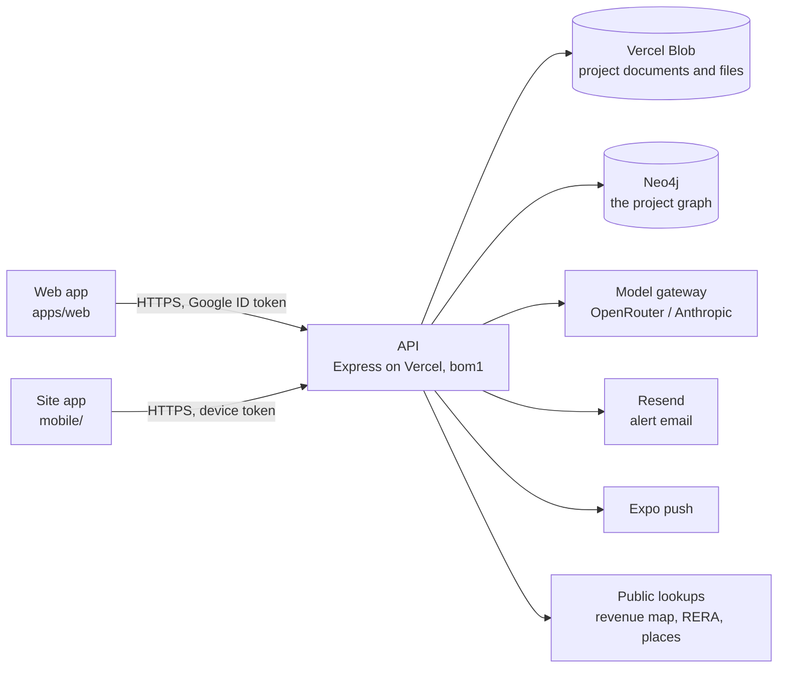

# Architecture

## The system



- **One API**, Express, deployed as a single Vercel function in Mumbai (`bom1`) and served beside the static web build. Locally the same app runs on port 5174.
- **Two stores, each doing what it is good at.** The project document store holds every record; Neo4j holds how the records connect. The graph is a projection of the store, rebuilt on every change and rebuildable from scratch, so the store is the source of truth and the graph is where connections are asked about.
- **The domain is pure.** Everything that is a function of a project — the stage timeline, quick assessments, the approvals register, progress, alerts, links, the graph projection — lives in `packages/shared` and runs the same in the API, the web app and the tests.

## The data model

A **project** is one JSON document (`DdProject`, `packages/shared/src/operating-model/types.ts`). It carries:

| Part | What it is | Module |
|---|---|---|
| Stage | `currentStage` (one of 12 steps) and `stageHistory` | `departments.ts` (`STAGES`, `stageTimeline`, `stageAt`) |
| Departments | `departments` (the six unless chosen), `team` (roles per department) | `departments.ts`, `team.ts` |
| Checks | assessments → scopes → checks; each check belongs to one workstream | `departments.ts` (`CHECK_WORKSTREAM`), `engagements.ts` |
| Engagements | `engagements[]`: kind, client, lead, due date, the workstreams it draws on | `engagements.ts` |
| Documents | `evidence[]`, each owned by a workstream (read from its type, or set by hand) | `vault.ts` |
| Approvals | read from the documents' types and facts against the stage | `approvals.ts` |
| Progress | `milestones[]`, `siteLog[]` (idempotent on the phone's id) | `progress.ts` |
| Quick assessments | computed per workstream, never stored | `quick-assessments.ts` |
| Certified reports | `certifiedReports[]` with a baseline snapshot and revisit flags | `certified.ts` |
| Alerts | `alerts[]`, raised and resolved by key on every save | `alerts.ts` |
| Links | system links read from the project, plus `links[]` people draw | `links.ts` |

**Checks live once.** An engagement draws on workstreams; it does not own checks. The checks a workstream needs are put on one internal assessment, the *project record*, the first time something needs them (`ensureWorkstreamChecks`), so the title check a lender's engagement uses is the same one the developer's screening answered.

**Quick assessments follow a source order.** Every input is labelled with where it came from, highest first: verified data on the file, the project's documents, government records and law, regulatory standards, licensed transaction data, portal listings, published sources, standard assumptions. A figure resting more than half on assumptions shows only as a rough range.

**Certified reports are the figure of record.** Filing one snapshots the quick assessment; on every save `evaluateRevisits` compares the live estimate with the certified one and flags the report for revisiting when a figure moves more than 10%, progress more than 5 points, or a new condition or blocker appears.

**A project is looked at one stage at a time.** The stage in view is not stored on the project. It is in the address, `?stage=land|pre|build|done` (`STAGE_WORD`), left out while it is the project's own stage and ignored when the word is none of the four. `ProjectCockpit` reads it and hands it to the bar, the tabs and every page. Links inside a project name no stage and are built in many places (`cockpitPath`, plain links), so the cockpit carries it instead of each link: an address that arrives without the word is looked at in the stage of the page before it and is then given the word. Going back or forward, or reloading, carries nothing, because there the address is what it was when it was left. Leaving the project drops it.

The rules are in `stage-view.ts`, on top of `departments.ts`, which says the stages each function has work in (`stages` on a workstream: the example project's list, held to the example's spec files by a test) and, more narrowly, what it delivers at each (`deliverables`). The menu follows the first. `menuAt` is a project's menu at a stage. `functionsHoldingRecords` names the functions that already hold the project's records, which `menuAt` keeps on show at the stage the project stands at; it counts what the graph draws a function's `holds`, `certifies` and `assesses` edges from, once in hand, and a test holds it against those edges. `stageInView` is the stage a page opens at: a page that is one function's opens at a stage that function shows at, the project's own first. `placeAtStage` is where the page on screen goes when another stage is picked.

## Storage

| | Locally | On Vercel |
|---|---|---|
| Workspace (tenants, members, grants, phones) | `<data dir>/v2/realytica.json` | `v2/store/realytica.json` on Blob |
| A project | `<data dir>/v2/uploads/<projectId>/project.json` | `v2/uploads/<projectId>/project.json` |
| Its files | `<data dir>/v2/uploads/<projectId>/<uuid>.<ext>` | `v2/uploads/<projectId>/…`, always private |

`v2` is the storage generation (`REALYTICA_STORAGE_NAMESPACE`). Starting a new generation resets the data without deleting anything: the previous one stays where it was, unread, so older code finds its own data again.

Each project is written on its own and only when its `updatedAt` moved. Before the write, `store.save()` evaluates revisits and syncs alerts for the projects that changed; after it, the graph is synced and newly raised alerts are sent by email and push.

## The graph

The project graph is a closed ontology (`project-ontology.ts`): six layers, a fixed set of node kinds and edge kinds, and rules for which kinds each edge may join. `buildProjectGraph` projects a project into it; `validateProjectGraph` proves the projection keeps the rules.

| Layer | Node kinds |
|---|---|
| structure | `stage`, `department`, `workstream`, `engagement`, `member`, `milestone` |
| entity | `project`, `asset`, `parcel`, `party`, `instrument`, `authority`, `encumbrance`, `approval` |
| evidence | `evidence`, `site_visit`, `sheet`, `site_entry`, `questionnaire` |
| claim | `contradiction`, `answer` |
| judgement | `assessment`, `scope`, `check`, `finding`, `risk`, `action`, `decision`, `report`, `quick_assessment`, `certified_report` |
| deliberation | `question`, `thought`, `proposal` |

The structure is the one the menu shows. Both take the five departments, the one-word names and the rule that Design sits under Engineering from `departments.ts` (`MENU_DEPARTMENTS`, `DEPARTMENT_SHORT`, `FUNCTION_SHORT`, `menuDepartment`). Both list the departments that are on with `menuDepartmentsOf` and a department's functions with `menuFunctions`, and both keep a function only while its own department is switched on, so the selector, the tabs and the graph cannot disagree about what a department holds. The graph asks for every stage at once. The menu (`rail.tsx`) passes the stage being looked at and gets the functions that show there. The graph names a workstream's function with `functionKey`.

| Node | Which ones | Id | Label |
|---|---|---|---|
| `stage` | Always four, one for each of `STAGES` | `<project>::stage::<stage key>` | Land, Pre-construction, Under construction, Completed |
| `department` | Each menu department that is switched on. Engineering is on while either `construction` or `design` is | `<project>::dept::<key>` | Legal, Finance, Engineering, Commercial, Procurement |
| `workstream` | Each function whose own department is switched on | `<project>::ws::<workstream key>`, and `<project>::ws::design` for Design | The function's one word: Title, Approvals, Valuation, Design |

The twelve finer steps are not nodes. Every stage carries `done`, `current` or `ahead` as its `status` and lists its steps in its `detail`, and the stage the project is in says first which one it is at ("At the Mobilisation step · Steps: Mobilisation, Construction, Testing & commissioning, Completion").

Design is not a department in the graph. Its four workstreams are the one function Design, under Engineering, and whatever names a design workstream (a check, a link, an engagement, a certified report) is joined to that one node, once. A role in Design is not a role in Engineering. It is said on the person ("Signer, Design") and draws no edge to a department, so Design's signer is never named as answering for Engineering's work. A person whose only role is in Design is tied to the project like any other record nothing places. When only Design is switched on, the Engineering node stands for Design alone: it is described as Design is and its `status` is `coming_soon`, taken from the functions drawn under it.

A function node keeps the kind `workstream`. The names the frame no longer draws are kept in the `detail` of what stands for them, which is what a search reads: a step on its stage, a department's name in full on the department ("Legal & Compliance", and "Engineering & Construction", so "Construction" finds Engineering), a function's name in full where it differs from its one word ("land records" finds Title), and Design's four workstreams on Design. `findProjectNodes` also answers to "function" and "functions" for the kind. Two functions share the word Handover, so wherever functions are named side by side the department is said with it ("Legal › Handover"; `withDepartment`).

The structural edges:

| Edge | From → to |
|---|---|
| `at_stage`, `precedes`, `in_stage` | project → the stage it is at; stage → the next; a record → the stage it arrived in |
| `has_department`, `has_workstream` | project → department → function |
| `holds` | function → a check, document, approval, milestone, visit, site entry or questionnaire |
| `gates`, `feeds` | approval or function → the function that cannot go ahead without it; function → one whose estimate it moves |
| `draws_on`, `delivers` | engagement → function; engagement → report |
| `assesses`, `certifies` | quick assessment → function; certified report → function |
| `leads`, `contributes_to`, `signs_for`, `views` | member → department |
| `advances` | site entry → the milestone it moved |
| `relates` | anything a person said belongs together |
| `has_record` | project → a record nothing else places |

…beside the register edges that were already there (`has_scope`, `has_check`, `supported_by`, `produces`, `raises`, `requires`, `affects`, `encumbers`, the title chain and so on).

**Nothing floats.** Every node can be reached from the project. Once the registers are written, the builder walks out from the project and ties to it whatever the walk did not arrive at. Where the kind has a relation of its own that is true of an unplaced record, it uses that (`has_risk`, `has_asset`, `reported_in`). Otherwise it uses `has_record`. That covers an action or a document that names nothing else on the file, a finding or a decision that has no date to place it in a stage, an approval or a milestone whose function is switched off, a person with no role in a department that is drawn, and a parcel or a party that only a title chain names. The last two are not tied with `sited_at` or `engaged_on`: on a file that declares no land of its own, the chain says the deeds name that parcel, not that the project stands on it.

Three limits on the tie. A record the project already reaches never gets it. Records joined only to each other get one between them, on whichever was written first. Talk does not count as placing a record: an edge that starts at a question, a thought or a proposal is left out of the walk, so a record keeps its tie when a chat turn cites it and the tie does not come and go as turns leave the window.

**Relations in plain words.** `PROJECT_EDGE_LABEL` gives every edge kind a phrase for each direction: "rests on" and "supports" for `supported_by`, "holds" and "is held by" for `holds`. It is a `Record` over the kind, so a relation cannot be added without its words. A phrase has to be true in every state the edge is drawn in, so `gates` reads "is needed before" and "cannot go ahead without", which holds for an approval that is missing. Three relations are drawn to a paper whether or not it has arrived (`supported_by`, `holds`, `has_record`), and no single phrase is true of both states. They have a second pair in `PROJECT_EDGE_LABEL_AWAITED`, "still needs" and "is still needed by", used when the record the edge reaches is a document that is expected, requested or missing, or an approval with nothing on file (`projectNodeAwaited`; a document's standing is its node's `status`). A document that was superseded or rejected is on file and not relied on, so `supported_by` and `holds` have a third pair in `PROJECT_EDGE_LABEL_SET_ASIDE`: "cited" and "was cited by", "keeps on file" and "is kept on file by" (`projectNodeSetAside`). `projectEdgePhrase` picks among the three. The Graph page, the title chain diagram and the neighbourhood handed to the copilot all read links with these words, never the key. The Graph page groups the links by the kind of thing at the other end, with documents, site visits, site entries and sheets first and no kind left out.

**Links drawn by hand.** `linkEdge` says which edge a link is drawn as, and `addLink` refuses a link whose edge the endpoint rules do not allow (a check cannot gate a function), naming `relates` as the way to say two things belong together. The system's own links all pass the same check.

### In Neo4j

Every node is `(:Ryt {id, projectId, kind, layer, origin, label, detail, key, status})` with its kind, layer and origin as extra labels; every edge is one relationship type, `[:RYT_EDGE {id, projectId, kind, origin, closedAt}]`, with the kind as an indexed property so a query is never built by interpolating a type. A sync replaces the project's derived nodes and *closes* edges it no longer draws rather than deleting them, so "what did this rest on in March" stays answerable. Constraints: unique `id`; indexes on `projectId`, `kind`, `origin`, `key`, edge `kind` and `closedAt` (`ensureNeo4jSchema`).

What a change reaches — the question behind the Connections panel and an expiring approval's alert — is a walk (`graph/neo4j.ts`, `impact`):

```cypher
// From a record to the functions it sits in, then on along gates and feeds.
MATCH (x:Ryt {projectId: $p, id: $id})
OPTIONAL MATCH (d:Ryt {projectId: $p})-[r:RYT_EDGE]->(x) WHERE r.kind IN ['supported_by','advances'] AND r.closedAt IS NULL
WITH x, [x] + collect(DISTINCT d) AS seeds
UNWIND seeds AS s
OPTIONAL MATCH (w:Ryt {projectId: $p})-[h:RYT_EDGE]->(s) WHERE w.kind = 'workstream' AND h.kind = 'holds' AND h.closedAt IS NULL
WITH seeds, collect(DISTINCT w) + [s IN seeds WHERE s.kind = 'workstream'] AS home
UNWIND home + [s IN seeds WHERE s.kind = 'approval'] AS start
MATCH p = (start)-[:RYT_EDGE*1..3]->(down:Ryt {projectId: $p, kind: 'workstream'})
WHERE all(r IN relationships(p) WHERE r.kind IN ['gates','feeds'] AND r.closedAt IS NULL)
RETURN down.label, length(p)
```

A second read finds the engagements, certified reports, quick assessments and the leads and signers standing on every function touched. The walk goes by kind and relation and never by id, so it needs no change when the frame does. The same walk runs over a snapshot in `graph-impact.ts`, for the local journal and as the fallback when Neo4j does not answer.

Useful queries:

```cypher
// Everything Legal holds on one project
MATCH (:Ryt {projectId: $p, kind: 'department', key: 'legal'})-[:RYT_EDGE {kind: 'has_workstream'}]->(w)-[h:RYT_EDGE {kind: 'holds'}]->(x)
WHERE h.closedAt IS NULL RETURN w.label, x.kind, x.label

// What arrived while the project was Under construction (a stage's key is its own: `construction` is the stage)
MATCH (x:Ryt {projectId: $p})-[r:RYT_EDGE {kind: 'in_stage'}]->(:stage {projectId: $p, key: 'construction'})
WHERE r.closedAt IS NULL RETURN x.kind, x.label

// Who answers for a function now (without the two `closedAt` tests it also returns people who used to)
MATCH (m:member {projectId: $p})-[r:RYT_EDGE]->(:department)-[f:RYT_EDGE {kind: 'has_workstream'}]->(w {key: 'finance.valuation'})
WHERE r.kind IN ['leads','signs_for'] AND r.closedAt IS NULL AND f.closedAt IS NULL RETURN m.label, r.kind

// The records nothing but the project places. Some are in hand and some are still needed: x.status says which
MATCH (:project {projectId: $p})-[r:RYT_EDGE {kind: 'has_record'}]->(x)
WHERE r.closedAt IS NULL RETURN x.kind, x.label, x.status
```

## Sign-in and access

- **People** sign in with Google; the API verifies the ID token itself (`auth/verify.ts`). The first allowed address to sign in to an empty workspace owns it. See [auth.md](auth.md).
- **Phones** pair with a code a signed-in person makes (`POST /api/devices/pair-code`, 8 characters, 10 minutes, one use). The phone trades it for a token of its own (`rdt_…`), stored only as a hash, which resolves to that person on every call, reaches only the site routes, and stops working when the phone is revoked or the person leaves.
- **Departments decide what a person may do.** A firm role sets the default (owners and managers lead, staff contribute, viewers read); the project's team list overrides it per department. Someone outside the firm reaches only the departments given to them, written as a grant the response redaction already understands.

## Documents

A document is filed once, in the vault, and owned by the workstream it belongs to. Reading happens in two passes:

1. **Locally**, always: the text layer, then OCR (English and Kannada, bundled) for scanned pages; the reader recognises the document type and lifts its facts with the words and page they came from (`document-parse.ts`).
2. **By a model**, when one is configured, for what the local reader could not make out. A PDF too long or too heavy to send whole is sent as a window — its first pages and its last, as many as fit — and every cited page is mapped back to the original.

Files larger than one serverless request (4.5 MB) go up in 4 MB parts (`POST /uploads`, `PUT /uploads/:id/parts/:n`, `POST /uploads/:id/complete`) and are assembled in storage.

## The chat

One chat per project, aware of the page it is on. A free model answers first and hands anything that needs judgement to the stronger model; deterministic commands and known questions never reach a model at all. The chat and the links propose; a person approves where the proposal lands. Nothing leaves the system — an email, a filing, money — without a named approver; internal alerts fire on their own.
