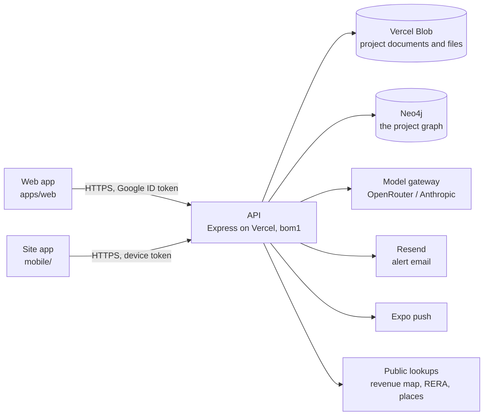

# Architecture

## The system



- **One API**, Express, deployed as a single Vercel function in Mumbai (`bom1`) and served beside the static web build. Locally the same app runs on port 5174.
- **Two stores, each doing what it is good at.** The project document store holds every record; Neo4j holds how the records connect. The graph is a projection of the store, rebuilt on every change and rebuildable from scratch, so the store is the source of truth and the graph is where connections are asked about.
- **The domain is pure.** Everything that is a function of a project — the stage timeline, quick assessments, the approvals register, progress, alerts, links, the graph projection — lives in `packages/shared` and runs the same in the API, the web app and the tests.

## The data model

A **project** is one JSON document (`DdProject`, `packages/shared/src/operating-model/types.ts`). It carries:

| Part | What it is | Module |
|---|---|---|
| Stage | `currentStage` (one of 12 steps) and `stageHistory` | `departments.ts` (`STAGES`, `stageTimeline`, `stageAt`) |
| Departments | `departments` (the six unless chosen), `team` (roles per department) | `departments.ts`, `team.ts` |
| Checks | assessments → scopes → checks; each check belongs to one workstream | `departments.ts` (`CHECK_WORKSTREAM`), `engagements.ts` |
| Engagements | `engagements[]`: kind, client, lead, due date, the workstreams it draws on | `engagements.ts` |
| Documents | `evidence[]`, each owned by a workstream (read from its type, or set by hand) | `vault.ts` |
| Approvals | read from the documents' types and facts against the stage | `approvals.ts` |
| Progress | `milestones[]`, `siteLog[]` (idempotent on the phone's id) | `progress.ts` |
| Quick assessments | computed per workstream, never stored | `quick-assessments.ts` |
| Certified reports | `certifiedReports[]` with a baseline snapshot and revisit flags | `certified.ts` |
| Alerts | `alerts[]`, raised and resolved by key on every save | `alerts.ts` |
| Links | system links read from the project, plus `links[]` people draw | `links.ts` |

**Checks live once.** An engagement draws on workstreams; it does not own checks. The checks a workstream needs are put on one internal assessment, the *project record*, the first time something needs them (`ensureWorkstreamChecks`), so the title check a lender's engagement uses is the same one the developer's screening answered.

**Quick assessments follow a source order.** Every input is labelled with where it came from, highest first: verified data on the file, the project's documents, government records and law, regulatory standards, licensed transaction data, portal listings, published sources, standard assumptions. A figure resting more than half on assumptions shows only as a rough range.

**Certified reports are the figure of record.** Filing one snapshots the quick assessment; on every save `evaluateRevisits` compares the live estimate with the certified one and flags the report for revisiting when a figure moves more than 10%, progress more than 5 points, or a new condition or blocker appears.

## Storage

| | Locally | On Vercel |
|---|---|---|
| Workspace (tenants, members, grants, phones) | `<data dir>/v2/realytica.json` | `v2/store/realytica.json` on Blob |
| A project | `<data dir>/v2/uploads/<projectId>/project.json` | `v2/uploads/<projectId>/project.json` |
| Its files | `<data dir>/v2/uploads/<projectId>/<uuid>.<ext>` | `v2/uploads/<projectId>/…`, always private |

`v2` is the storage generation (`REALYTICA_STORAGE_NAMESPACE`). Starting a new generation resets the data without deleting anything: the previous one stays where it was, unread, so older code finds its own data again.

Each project is written on its own and only when its `updatedAt` moved. Before the write, `store.save()` evaluates revisits and syncs alerts for the projects that changed; after it, the graph is synced and newly raised alerts are sent by email and push.

## The graph

The project graph is a closed ontology (`project-ontology.ts`): six layers, a fixed set of node kinds and edge kinds, and rules for which kinds each edge may join. `buildProjectGraph` projects a project into it; `validateProjectGraph` proves the projection keeps the rules.

| Layer | Node kinds |
|---|---|
| structure | `stage`, `department`, `workstream`, `engagement`, `member`, `milestone` |
| entity | `project`, `asset`, `parcel`, `party`, `instrument`, `authority`, `encumbrance`, `approval` |
| evidence | `evidence`, `site_visit`, `sheet`, `site_entry` |
| claim | `contradiction` |
| judgement | `assessment`, `scope`, `check`, `finding`, `risk`, `action`, `decision`, `report`, `quick_assessment`, `certified_report` |
| deliberation | `question`, `thought`, `proposal` |

The structural edges:

| Edge | From → to |
|---|---|
| `at_stage`, `precedes`, `in_stage` | project → its step; step → the next; a record → the step it happened in |
| `has_department`, `has_workstream` | project → department → workstream |
| `holds` | workstream → a check, document, approval, milestone, visit or site entry |
| `gates`, `feeds` | approval or workstream → the workstream it allows; workstream → one whose estimate it moves |
| `draws_on`, `delivers` | engagement → workstream; engagement → report |
| `assesses`, `certifies` | quick assessment → workstream; certified report → workstream |
| `leads`, `contributes_to`, `signs_for`, `views` | member → department |
| `advances` | site entry → the milestone it moved |
| `relates` | anything a person said belongs together |

…beside the register edges that were already there (`has_scope`, `has_check`, `supported_by`, `produces`, `raises`, `requires`, `affects`, `encumbers`, the title chain and so on).

### In Neo4j

Every node is `(:Ryt {id, projectId, kind, layer, origin, label, detail, key, status})` with its kind, layer and origin as extra labels; every edge is one relationship type, `[:RYT_EDGE {id, projectId, kind, origin, closedAt}]`, with the kind as an indexed property so a query is never built by interpolating a type. A sync replaces the project's derived nodes and *closes* edges it no longer draws rather than deleting them, so "what did this rest on in March" stays answerable. Constraints: unique `id`; indexes on `projectId`, `kind`, `origin`, `key`, edge `kind` and `closedAt` (`ensureNeo4jSchema`).

What a change reaches — the question behind the Connections panel and an expiring approval's alert — is a walk (`graph/neo4j.ts`, `impact`):

```cypher
// From a record to the workstreams it sits in, then on along gates and feeds.
MATCH (x:Ryt {projectId: $p, id: $id})
OPTIONAL MATCH (d:Ryt {projectId: $p})-[r:RYT_EDGE]->(x) WHERE r.kind IN ['supported_by','advances'] AND r.closedAt IS NULL
WITH x, [x] + collect(DISTINCT d) AS seeds
UNWIND seeds AS s
OPTIONAL MATCH (w:Ryt {projectId: $p})-[h:RYT_EDGE]->(s) WHERE w.kind = 'workstream' AND h.kind = 'holds' AND h.closedAt IS NULL
WITH seeds, collect(DISTINCT w) + [s IN seeds WHERE s.kind = 'workstream'] AS home
UNWIND home + [s IN seeds WHERE s.kind = 'approval'] AS start
MATCH p = (start)-[:RYT_EDGE*1..3]->(down:Ryt {projectId: $p, kind: 'workstream'})
WHERE all(r IN relationships(p) WHERE r.kind IN ['gates','feeds'] AND r.closedAt IS NULL)
RETURN down.label, length(p)
```

A second read finds the engagements, certified reports, quick assessments and the leads and signers standing on every workstream touched. The same walk runs over a snapshot in `graph-impact.ts`, for the local journal and as the fallback when Neo4j does not answer.

Useful queries:

```cypher
// Everything Legal holds on one project
MATCH (:Ryt {projectId: $p, kind: 'department', key: 'legal'})-[:RYT_EDGE {kind: 'has_workstream'}]->(w)-[h:RYT_EDGE {kind: 'holds'}]->(x)
WHERE h.closedAt IS NULL RETURN w.label, x.kind, x.label

// What happened while the project was Under construction
MATCH (x:Ryt {projectId: $p})-[:RYT_EDGE {kind: 'in_stage'}]->(s:stage {projectId: $p})
WHERE s.detail = 'Under construction' RETURN s.label, x.kind, x.label

// Who answers for a workstream
MATCH (m:member {projectId: $p})-[r:RYT_EDGE]->(:department)-[:RYT_EDGE {kind: 'has_workstream'}]->(w {key: 'finance.valuation'})
WHERE r.kind IN ['leads','signs_for'] RETURN m.label, r.kind
```

## Sign-in and access

- **People** sign in with Google; the API verifies the ID token itself (`auth/verify.ts`). The first allowed address to sign in to an empty workspace owns it. See [auth.md](auth.md).
- **Phones** pair with a code a signed-in person makes (`POST /api/devices/pair-code`, 8 characters, 10 minutes, one use). The phone trades it for a token of its own (`rdt_…`), stored only as a hash, which resolves to that person on every call, reaches only the site routes, and stops working when the phone is revoked or the person leaves.
- **Departments decide what a person may do.** A firm role sets the default (owners and managers lead, staff contribute, viewers read); the project's team list overrides it per department. Someone outside the firm reaches only the departments given to them, written as a grant the response redaction already understands.

## Documents

A document is filed once, in the vault, and owned by the workstream it belongs to. Reading happens in two passes:

1. **Locally**, always: the text layer, then OCR (English and Kannada, bundled) for scanned pages; the reader recognises the document type and lifts its facts with the words and page they came from (`document-parse.ts`).
2. **By a model**, when one is configured, for what the local reader could not make out. A PDF too long or too heavy to send whole is sent as a window — its first pages and its last, as many as fit — and every cited page is mapped back to the original.

Files larger than one serverless request (4.5 MB) go up in 4 MB parts (`POST /uploads`, `PUT /uploads/:id/parts/:n`, `POST /uploads/:id/complete`) and are assembled in storage.

## The chat

One chat per project, aware of the page it is on. A free model answers first and hands anything that needs judgement to the stronger model; deterministic commands and known questions never reach a model at all. The chat and the links propose; a person approves where the proposal lands. Nothing leaves the system — an email, a filing, money — without a named approver; internal alerts fire on their own.
