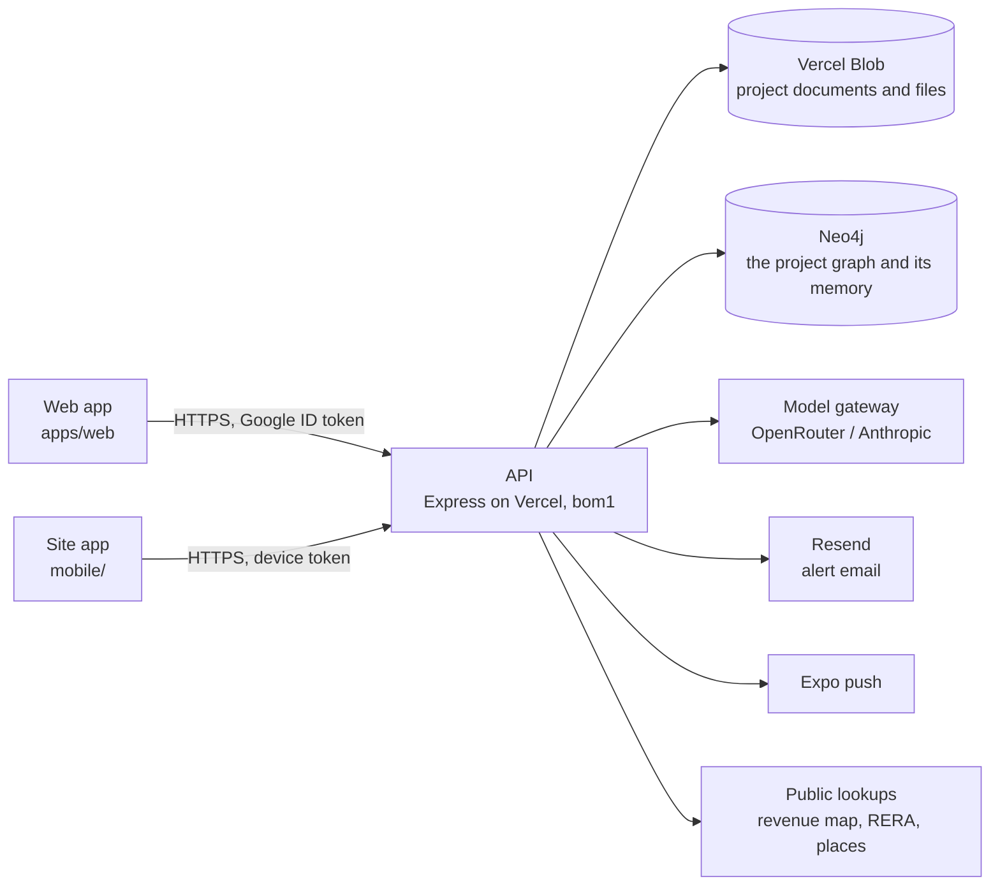

# Architecture

## The system



- **One API**, Express, deployed as a single Vercel function in Mumbai (`bom1`) and served beside the static web build. Locally the same app runs on port 5174.
- **Two stores, each doing what it is good at.** The project document store holds every record; Neo4j holds how the records connect. The graph is a projection of the store, rebuilt on every change and rebuildable from scratch, so the store is the source of truth and the graph is where connections are asked about. Neo4j also holds the project's memory, apart from the graph: see [The project's memory](#the-projects-memory).
- **The domain is pure.** Everything that is a function of a project — the stage timeline, quick assessments, the approvals register, progress, alerts, links, the graph projection — lives in `packages/shared` and runs the same in the API, the web app and the tests.

## The data model

A **project** is one JSON document (`DdProject`, `packages/shared/src/operating-model/types.ts`). It carries:

| Part | What it is | Module |
|---|---|---|
| Stage | `currentStage` (one of 12 steps) and `stageHistory` | `departments.ts` (`STAGES`, `stageTimeline`, `stageAt`) |
| Departments | `departments` (the six unless chosen), `team` (roles per department) | `departments.ts`, `team.ts` |
| Checks | assessments → scopes → checks; each check belongs to one workstream | `departments.ts` (`CHECK_WORKSTREAM`), `engagements.ts` |
| Engagements | `engagements[]`: kind, client, lead, due date, the workstreams it draws on | `engagements.ts` |
| Documents | `evidence[]`, each owned by a workstream (read from its type, or set by hand) | `vault.ts` |
| Approvals | read from the documents' types and facts against the stage | `approvals.ts` |
| Progress | `milestones[]`, `siteLog[]` (idempotent on the phone's id) | `progress.ts` |
| Quick assessments | computed per workstream, never stored | `quick-assessments.ts` |
| Certified reports | `certifiedReports[]` with a baseline snapshot and revisit flags | `certified.ts` |
| Alerts | `alerts[]`, raised and resolved by key on every save | `alerts.ts` |
| Links | system links read from the project, plus `links[]` people draw | `links.ts` |

**Checks live once.** An engagement draws on workstreams; it does not own checks. The checks a workstream needs are put on one internal assessment, the *project record*, the first time something needs them (`ensureWorkstreamChecks`), so the title check a lender's engagement uses is the same one the developer's screening answered.

**Quick assessments follow a source order.** Every input is labelled with where it came from, highest first: verified data on the file, the project's documents, government records and law, regulatory standards, licensed transaction data, portal listings, published sources, standard assumptions. A figure resting more than half on assumptions shows only as a rough range.

**Certified reports are the figure of record.** Filing one snapshots the quick assessment; on every save `evaluateRevisits` compares the live estimate with the certified one and flags the report for revisiting when a figure moves more than 10%, progress more than 5 points, or a new condition or blocker appears.

**A project is looked at one stage at a time.** The stage in view is not stored on the project. It is in the address, `?stage=land|pre|build|done` (`STAGE_WORD`), left out while it is the project's own stage and ignored when the word is none of the four. `ProjectCockpit` reads it and hands it to the bar, the tabs and every page. Links inside a project name no stage and are built in many places (`cockpitPath`, plain links), so the cockpit carries it instead of each link: an address that arrives without the word is looked at in the stage of the page before it and is then given the word. Going back or forward, or reloading, carries nothing, because there the address is what it was when it was left. Leaving the project drops it.

The rules are in `stage-view.ts`, on top of `departments.ts`, which says the stages each function has work in (`stages` on a workstream: the example project's list, held to the example's spec files by a test) and, more narrowly, what it delivers at each (`deliverables`). The menu follows the first. `menuAt` is a project's menu at a stage. `functionsHoldingRecords` names the functions that already hold the project's records, which `menuAt` keeps on show at the stage the project stands at; it counts what the graph draws a function's `holds`, `certifies` and `assesses` edges from, once in hand, and a test holds it against those edges. `stageInView` is the stage a page opens at: a page that is one function's opens at a stage that function shows at, the project's own first. `placeAtStage` is where the page on screen goes when another stage is picked.

## Storage

| | Locally | On Vercel |
|---|---|---|
| Workspace (tenants, members, grants, phones) | `<data dir>/v2/realytica.json` | `v2/store/realytica.json` on Blob |
| A project | `<data dir>/v2/uploads/<projectId>/project.json` | `v2/uploads/<projectId>/project.json` |
| Its files | `<data dir>/v2/uploads/<projectId>/<uuid>.<ext>` | `v2/uploads/<projectId>/…`, always private |

`v2` is the storage generation (`REALYTICA_STORAGE_NAMESPACE`). Starting a new generation resets the data without deleting anything: the previous one stays where it was, unread, so older code finds its own data again.

Each project is written on its own and only when its `updatedAt` moved. Before the write, `store.save()` evaluates revisits and syncs alerts for the projects that changed; after it, the graph is synced and newly raised alerts are sent by email and push, and once the reply has gone the project's memory is told what the write holds.

The workspace document's `projectIds` is the index of projects. An instance adds to it the projects it created and takes out the ones it removed, and means to do nothing else: it does not take out a project it does not hold, because another instance created it since or because its document would not load. An entry can still be lost. The document is read, merged and written with nothing between, so of two instances writing it at the same moment the later write carries the list as that instance read it, without what the other added. A project lost that way is not gone: its document and files are still under `uploads/<projectId>/`. An instance that holds it keeps it, because a project is taken for removed only when its document is gone as well, and names it in the index again at its next save. So does an instance that is asked for it by id (opening `/projects/<projectId>` reads the document). A graph, its notes and the project's memory are dropped only for a project whose document is gone, and only on storage's clear answer that it is: while storage cannot say, nothing is dropped and the next save asks again.

A removal takes the documents out of storage first, and the index entry after (`removeProject`, `project-removal.ts`). If the documents will not go, the project stays as it was and the person who asked is told. While they are going the project is off the removing instance's list, and that instance reads none of them back onto it (`Store.takeOff`), however many requests about the project arrive meanwhile: a page left open on a project asks for it about once a second, and removing a project's files can take longer. Nothing in storage says a project was removed. So another instance that still holds the project and writes to it in the moment before it notices, puts the document back, and the project with it.

Every write of a project's document carries a revision, `storeRevision` in the stored file. It is the store's own: taken off as a document is read, so no project in memory carries it and an undo cannot put an old one back. It is one more than the highest that instance has seen for the project, and never behind the clock. That guarantees a write is numbered above every copy the writing instance has read or written. It does not guarantee that the later of two writes by instances that have not read each other has the higher number: that holds only as far as their clocks agree. `updatedAt` does not order copies at all: it is the time of what was read or decided, not of the write.

The graph store is owed every copy an instance writes, and every copy it reads, at that copy's revision. It refuses a copy older than the one it holds, and for one it has already drawn it writes nothing but the revision, so being offered a project again costs one statement. A save waits, for two seconds in all (`GRAPH_WAIT_MS`), on the copies it wrote and on dropping the graphs of projects it removed. What an instance has only read it offers afterwards, with nothing waiting, which is what catches up a graph that was left behind: by a sync lost with its instance, by an outage, or by new code that draws the same record differently. A call still running when the wait ends is not abandoned. It is handed to the platform to finish after the reply, and its answer still counts. A graph store that is slow, down or failing never fails a save, and while it is down only saves ask it. When it refuses a copy that the project store still holds, which happens when the later write came from the slower clock, that copy is offered again above the number held.

## The graph

The project graph is a closed ontology (`project-ontology.ts`): six layers, a fixed set of node kinds and edge kinds, and rules for which kinds each edge may join. `buildProjectGraph` projects a project into it; `validateProjectGraph` proves the projection keeps the rules.

| Layer | Node kinds |
|---|---|
| structure | `stage`, `department`, `workstream`, `engagement`, `member`, `milestone` |
| entity | `project`, `asset`, `parcel`, `party`, `instrument`, `authority`, `encumbrance`, `approval` |
| evidence | `evidence`, `site_visit`, `sheet`, `site_entry`, `questionnaire` |
| claim | `contradiction`, `answer` |
| judgement | `assessment`, `scope`, `check`, `finding`, `risk`, `action`, `decision`, `report`, `quick_assessment`, `certified_report` |
| deliberation | `question`, `thought`, `proposal` |

The structure is the one the menu shows. Both take the five departments, the one-word names and the rule that Design sits under Engineering from `departments.ts` (`MENU_DEPARTMENTS`, `DEPARTMENT_SHORT`, `FUNCTION_SHORT`, `menuDepartment`). Both list the departments that are on with `menuDepartmentsOf` and a department's functions with `menuFunctions`, and both keep a function only while its own department is switched on, so the selector, the tabs and the graph cannot disagree about what a department holds. The graph asks for every stage at once. The menu (`rail.tsx`) passes the stage being looked at and gets the functions that show there. The graph names a workstream's function with `functionKey`.

| Node | Which ones | Id | Label |
|---|---|---|---|
| `stage` | Always four, one for each of `STAGES` | `<project>::stage::<stage key>` | Land, Pre-construction, Under construction, Completed |
| `department` | Each menu department that is switched on. Engineering is on while either `construction` or `design` is | `<project>::dept::<key>` | Legal, Finance, Engineering, Commercial, Procurement |
| `workstream` | Each function whose own department is switched on | `<project>::ws::<workstream key>`, and `<project>::ws::design` for Design | The function's one word: Title, Approvals, Valuation, Design |

The twelve finer steps are not nodes. Every stage carries `done`, `current` or `ahead` as its `status` and lists its steps in its `detail`, and the stage the project is in says first which one it is at ("At the Mobilisation step · Steps: Mobilisation, Construction, Testing & commissioning, Completion").

Design is not a department in the graph. Its four workstreams are the one function Design, under Engineering, and whatever names a design workstream (a check, a link, an engagement, a certified report) is joined to that one node, once. A role in Design is not a role in Engineering. It is said on the person ("Signer, Design") and draws no edge to a department, so Design's signer is never named as answering for Engineering's work. A person whose only role is in Design is tied to the project like any other record nothing places. When only Design is switched on, the Engineering node stands for Design alone: it is described as Design is and its `status` is `coming_soon`, taken from the functions drawn under it.

A function node keeps the kind `workstream`. The names the frame no longer draws are kept in the `detail` of what stands for them, which is what a search reads: a step on its stage, a department's name in full on the department ("Legal & Compliance", and "Engineering & Construction", so "Construction" finds Engineering), a function's name in full where it differs from its one word ("land records" finds Title), and Design's four workstreams on Design. `findProjectNodes` also answers to "function" and "functions" for the kind. Two functions share the word Handover, so wherever functions are named side by side the department is said with it ("Legal › Handover"; `withDepartment`).

The structural edges:

| Edge | From → to |
|---|---|
| `at_stage`, `precedes`, `in_stage` | project → the stage it is at; stage → the next; a record → the stage it arrived in |
| `has_department`, `has_workstream` | project → department → function |
| `holds` | function → a check, document, approval, milestone, visit, site entry or questionnaire |
| `gates`, `feeds` | approval or function → the function that cannot go ahead without it; function → one whose estimate it moves |
| `draws_on`, `delivers` | engagement → function; engagement → report |
| `assesses`, `certifies` | quick assessment → function; certified report → function |
| `leads`, `contributes_to`, `signs_for`, `views` | member → department |
| `advances` | site entry → the milestone it moved |
| `relates` | anything a person said belongs together |
| `has_record` | project → a record nothing else places |

…beside the register edges that were already there (`has_scope`, `has_check`, `supported_by`, `produces`, `raises`, `requires`, `affects`, `encumbers`, the title chain and so on).

**Nothing floats.** Every node can be reached from the project. Once the registers are written, the builder walks out from the project and ties to it whatever the walk did not arrive at. Where the kind has a relation of its own that is true of an unplaced record, it uses that (`has_risk`, `has_asset`, `reported_in`). Otherwise it uses `has_record`. That covers an action or a document that names nothing else on the file, a finding or a decision that has no date to place it in a stage, an approval or a milestone whose function is switched off, a person with no role in a department that is drawn, and a parcel or a party that only a title chain names. The last two are not tied with `sited_at` or `engaged_on`: on a file that declares no land of its own, the chain says the deeds name that parcel, not that the project stands on it.

Three limits on the tie. A record the project already reaches never gets it. Records joined only to each other get one between them, on whichever was written first. Talk does not count as placing a record: an edge that starts at a question, a thought or a proposal is left out of the walk, so a record keeps its tie when a chat turn cites it and the tie does not come and go as turns leave the window.

**Relations in plain words.** `PROJECT_EDGE_LABEL` gives every edge kind a phrase for each direction: "rests on" and "supports" for `supported_by`, "holds" and "is held by" for `holds`. It is a `Record` over the kind, so a relation cannot be added without its words. A phrase has to be true in every state the edge is drawn in, so `gates` reads "is needed before" and "cannot go ahead without", which holds for an approval that is missing. Three relations are drawn to a paper whether or not it has arrived (`supported_by`, `holds`, `has_record`), and no single phrase is true of both states. They have a second pair in `PROJECT_EDGE_LABEL_AWAITED`, "still needs" and "is still needed by", used when the record the edge reaches is a document that is expected, requested or missing, or an approval with nothing on file (`projectNodeAwaited`; a document's standing is its node's `status`). A document that was superseded or rejected is on file and not relied on, so `supported_by` and `holds` have a third pair in `PROJECT_EDGE_LABEL_SET_ASIDE`: "cited" and "was cited by", "keeps on file" and "is kept on file by" (`projectNodeSetAside`). `projectEdgePhrase` picks among the three. The Graph page, the title chain diagram and the neighbourhood handed to the copilot all read links with these words, never the key. The Graph page groups the links by the kind of thing at the other end, with documents, site visits, site entries and sheets first and no kind left out.

**Links drawn by hand.** `linkEdge` says which edge a link is drawn as, and `addLink` refuses a link whose edge the endpoint rules do not allow (a check cannot gate a function), naming `relates` as the way to say two things belong together. The system's own links all pass the same check.

### In Neo4j

Every node is `(:Ryt {id, projectId, kind, layer, origin, label, detail, key, status})` with its kind, layer and origin as extra labels; every edge is one relationship type, `[:RYT_EDGE {id, projectId, kind, origin, closedAt}]`, with the kind as an indexed property so a query is never built by interpolating a type. A sync replaces the project's derived nodes and *closes* edges it no longer draws rather than deleting them, so "what did this rest on in March" stays answerable. Constraints: unique `id`; indexes on `projectId`, `kind`, `origin`, `key`, edge `kind` and `closedAt` (`ensureNeo4jSchema`).

One node a project is not part of the graph: `(:GraphSync {projectId, revision, drawing, asked})`, unique by `projectId`, holding the revision of the project copy the stored graph was built from and a digest of what was drawn. A sync takes it first, in the transaction that writes. It writes nothing if its own revision is lower, so an instance holding an older copy cannot delete what a newer copy drew, and nothing but the marker if its drawing is the one stored. Otherwise it is five statements, whatever the project holds: the marker, the nodes with their labels, the edges, the nodes to remove and the edges to close. Two syncs of one project wait for each other on the marker. No statement that reads or rebuilds the graph matches it, and a purge removes it with the project's nodes. Every write is given ten seconds by the database, after which it is ended.

The marker says what the graph draws only among builds that keep it. A build that predates it rewrites or purges the graph and leaves the marker saying what it said, and a later revision does not by itself put that right, because a copy that draws what the marker names writes nothing. So a copy counts as drawn only if the project also holds as many derived nodes as the copy draws, which notices a purge and a redraw to a different number of nodes. A redraw to the same number of nodes stays until the drawing next changes. The local journal keeps no note of the drawing: it compares a copy with what it holds.

What a change reaches — the question behind the Connections panel and an expiring approval's alert — is a walk (`graph/neo4j.ts`, `impact`):

```cypher
// From a record to the functions it sits in, then on along gates and feeds.
MATCH (x:Ryt {projectId: $p, id: $id})
OPTIONAL MATCH (d:Ryt {projectId: $p})-[r:RYT_EDGE]->(x) WHERE r.kind IN ['supported_by','advances'] AND r.closedAt IS NULL
WITH x, [x] + collect(DISTINCT d) AS seeds
UNWIND seeds AS s
OPTIONAL MATCH (w:Ryt {projectId: $p})-[h:RYT_EDGE]->(s) WHERE w.kind = 'workstream' AND h.kind = 'holds' AND h.closedAt IS NULL
WITH seeds, collect(DISTINCT w) + [s IN seeds WHERE s.kind = 'workstream'] AS home
UNWIND home + [s IN seeds WHERE s.kind = 'approval'] AS start
MATCH p = (start)-[:RYT_EDGE*1..3]->(down:Ryt {projectId: $p, kind: 'workstream'})
WHERE all(r IN relationships(p) WHERE r.kind IN ['gates','feeds'] AND r.closedAt IS NULL)
RETURN down.label, length(p)
```

A second read finds the engagements, certified reports, quick assessments and the leads and signers standing on every function touched. The walk goes by kind and relation and never by id, so it needs no change when the frame does. The same walk runs over a snapshot in `graph-impact.ts`, for the local journal and as the fallback when Neo4j does not answer.

Useful queries:

```cypher
// Everything Legal holds on one project
MATCH (:Ryt {projectId: $p, kind: 'department', key: 'legal'})-[:RYT_EDGE {kind: 'has_workstream'}]->(w)-[h:RYT_EDGE {kind: 'holds'}]->(x)
WHERE h.closedAt IS NULL RETURN w.label, x.kind, x.label

// What arrived while the project was Under construction (a stage's key is its own: `construction` is the stage)
MATCH (x:Ryt {projectId: $p})-[r:RYT_EDGE {kind: 'in_stage'}]->(:stage {projectId: $p, key: 'construction'})
WHERE r.closedAt IS NULL RETURN x.kind, x.label

// Who answers for a function now (without the two `closedAt` tests it also returns people who used to)
MATCH (m:member {projectId: $p})-[r:RYT_EDGE]->(:department)-[f:RYT_EDGE {kind: 'has_workstream'}]->(w {key: 'finance.valuation'})
WHERE r.kind IN ['leads','signs_for'] AND r.closedAt IS NULL AND f.closedAt IS NULL RETURN m.label, r.kind

// The records nothing but the project places. Some are in hand and some are still needed: x.status says which
MATCH (:project {projectId: $p})-[r:RYT_EDGE {kind: 'has_record'}]->(x)
WHERE r.closedAt IS NULL RETURN x.kind, x.label, x.status
```

## The project's memory

Memory is kept in the graph store, beside the graph and apart from it. The graph is a drawing of the record as it stands now. Memory is what the project has been told, event by event, and a redraw does not touch it. So far it holds its ground only: one entry for every event that changes what a project knows.

**What is told.** `memoryDelta` (`packages/shared/src/operating-model/mem-delta.ts`) turns a project's record into entries. It is pure and shared, so every build gives the same event the same id.

| Entry | Told from |
|---|---|
| `paper_filed`, `file_added` | the audit event of a paper's filing, and of a file added to it |
| `paper_read` | the paper, with its filing, when the row already holds what was read off it |
| `value_accepted`, `value_corrected`, `value_set_aside`, `value_reopened` | the audit event of the decision |
| `chat_asked`, `chat_answered` | the turn in the conversation |
| `edit_noted` | the note a work-pane write leaves in the conversation: its two turns, as one entry |
| `decision_recorded`, `action_recorded`, `finding_raised` | the audit event that created the record |
| `map_read_kept`, `map_read_removed` | the audit event of a read of the public map kept or taken off |
| `undone` | the audit event of an undo. The events of what was put back stay, and this says they no longer stand |

Three of these have no audit event. A chat turn and a work-pane note are told from the conversation, which is why memory keeps a second watermark. A paper read is told with the paper's filing, so a paper read again later is not told. A value proposed and not yet decided has no event either and is not told. Every other audit event is passed over.

A chat turn is told once it has its author. A request writes its turns, may save the project while it waits on a model, and names who asked and on which page only when the answer is back. So a turn with no author waits, and every turn after it waits behind it. One still unnamed after fifteen minutes (`MEM_TURN_WAIT_MS`) is told as nobody's: no request runs that long.

A work-pane note does not wait. A write made on a work pane leaves a line in the conversation and a one-word reply (`noteProjectEdit`), written whole, and nothing comes back to name them. The pair is one entry, told from the line, at once: its author's when the write names one, and nobody's when it does not. The reply's `pane_write` tool call is what tells a note from a question still waiting for its answer.

**What an entry holds.** Its `id` (the project's id, `::mem::`, then the id of what told it), `kind`, `at`, `by`, `sourceId`, and `about`: the ids of the records it is about. An entry holds no words of the record's, with one exception: a map read points at its parcel by the key the record keeps the read under (`kgis:<village code>:<survey number>`, or `ulb:` or `rural:` and a number), which names land and no person. It is kept only in that fixed form, the map reader's own (`MEM_PARCEL_REF`), and a map read points at nothing else. An entry about a value carries the value's `key` and, as its `label`, the name the fixed list of keys gives that key (`STANDARD_FACT_KEYS`); a value under a key that is not on the list is told with neither. A chat turn carries the page it was asked on, in the menu's own words. `by` is not an email. It is an id made from the project and the person, the same for one person on one project and different on another. An id the graph makes from words on the record is kept the same way, as a token for the words (`memPointer`): a person's node carries their email, and a node of the title chain carries a name or a number read off a paper. `writeMemory` (`graph/mem/write.ts`) is the one way into memory, and it passes every entry through `scrubMemEntry`: an entry's own properties are kept and nothing else, a label is never taken from the caller, and a place is the product's own words or nothing. Titles are looked up when memory is read, on the record as it stands then.

**In Neo4j.** One `(:MemProject {id, projectId, tenantId, schema, auditThrough, turnThrough, live, asked, writtenAt})` a project, with the id `<projectId>::mem`, and one `(:MemEntry {id, projectId, tenantId, kind, at, by, sourceId, about, key, label, pane, department, fn, stage})` an event. `id` is unique for each label and `MemEntry.projectId` is indexed; the memory store makes these before its first write, not at boot. No statement of memory's names `Ryt`, `RYT_EDGE` or `GraphSync`, and none creates a relationship: an entry points at the record by ids it holds as properties, because a relationship to a graph node would go the first time a build redrew the project without that node. A build that knows only the graph therefore syncs and purges without meeting a memory node. Every write is given ten seconds by the database and every read five. Locally memory is a file of its own, `project-memory-journal.json`, beside the graph's journal.

**How it is written.** Each instance owes memory every copy of a project it writes and every copy it reads. A pass tells what is owed once the reply has gone (`remember` in `store.ts`, kept alive by the platform), for two seconds at a time (`MEMORY_WAIT_MS`), and only from a copy as the project store holds it. A write is one transaction. It takes the project's `MemProject` node and writes to it before reading it, so two writers of one project's memory go one after the other. It then writes nothing if the writer may not write over what memory holds (see the shape, below), and nothing if memory does not stand where the writer believed, answering where it does stand so the writer can ask again. A write that is turned away ends with nothing written, not even the node it took. Otherwise the entries and the watermark go in together. An entry is created and never changed, and its project is set when it is made and never after. The one thing that changes an entry is a write that starts the project's memory over, which lets every entry go and tells them again. So a write that fails leaves memory where it stood, the next save or read of the project on any instance tells the same events again, and an entry told twice is one entry. One write tells at most 500 events (`MEM_AT_MOST`); a longer record takes several.

A copy of the project that does not hold the event or the turn the watermark names tells nothing: it is an older copy. Unless the project store still holds that very copy. Then it is the record that lost the event, because the last of two writers of one project keeps its copy, and everything the record holds now is told (`memoryReplay`). Memory keeps the entry of an audit event the record lost. Chats are the exception: when it is the turn the record has lost, which is what deleting the chats does, the entries told from the conversation are let go in the same write, and only the turns the record holds now are told.

A conversation is told from its start only by the copy the project store holds. After the chats are deleted memory stands at no turn, exactly as it does for a conversation never told, and an instance that read the project before the deletion still holds the turns. So before a pass tells turns from the start it asks the project store whether it still holds that copy (one read of the project's document), and an older copy tells nothing.

A failure is logged once a pass and never fails a save. While the memory store fails every call, only saves ask it.

**The shape, and who may write over it.** `MEM_SCHEMA` is the shape a build writes, raised with every change to what an entry holds or to which events are told (a test pins the shape to the schema). A project's memory says which shape it is in and whether the live site wrote it: `live` on its `MemProject` node, set by the live site's own write and by no other, and never taken off. The live site is the deployment Vercel runs as production: named production, at the address Vercel serves it from (`memWriter`, `graph/mem/write.ts`). A preview is not, and neither is a laptop, a test or the probe, though any of them may be pointed at the live site's database, and though a machine may hold production's settings.

The rule is `shapeRule` (`graph/mem/types.ts`), kept by both stores inside the write:

| The writer | Memory the live site has not written | Memory the live site wrote |
|---|---|---|
| Not the live site, same shape | carries on | carries on |
| Not the live site, memory in an earlier shape | starts it over | is turned away, and says so once in its log |
| Not the live site, memory in a later shape | stands down | stands down |
| The live site, same shape | starts it over | carries on |
| The live site, memory in an earlier shape | starts it over | starts it over |
| The live site, memory in a later shape | starts it over | stands down: a later live build wrote it |

Starting over is one write: every node memory keeps for the project is let go, the project's own node is made again, and the record is told from its first event in the writer's shape. That is what happens to entries written in an earlier shape: they are neither left nor rewritten, they go, and every event is told again, so no entry stays as an earlier rule wrote it. A record longer than one write is told over several, the first of which starts over and the rest carry on. Starting over costs nothing while everything memory holds can be told again from the record, which is so today. Anything kept in memory later that the record cannot tell again would be lost by it, and has to be carried across before that is built.

So until the live site writes a project's memory, that memory is the previews': the latest shape among them holds it, and a branch that changes the shape can be tried on its preview against the shared database. The first write the live site makes to a project trusts nothing a preview left, whatever its shape, and from then on only the live site raises that project's shape. Nothing a preview writes makes the live site stand down. The pass works the rule out first from where it last knew memory to stand, so a deployment that is turned away makes no write; and it does not keep that answer, so it writes again as soon as the live site has raised the shape. A preview's graph stays detached, as `graph/preview.ts` has it.

**Room.** A database with an allowance of nodes counts the graph's and memory's together, and memory is one node an event. The read route below counts the nodes of a project's memory and, for the workspace's admins, every node in the database, so the number can be watched. When the database turns a write of memory away for want of room, that is said once in the log and nothing more is written until a write is taken again; only saves ask in the meantime. The graph is offered apart from memory and goes on being drawn for as long as it has room itself. Nothing is pruned yet.

**A project that is gone** takes its memory with it: removing a project removes every `Mem` node of it, as soon as its documents are gone. `removeProject` (`project-removal.ts`) removes the documents first and, when they will not go, leaves the project as it was and says so; see the project store, above. A build that knows nothing of memory leaves the nodes behind. So an instance looks, at most once a minute, for memory in the workspaces its project store holds whose project it does not hold and whose document is gone from storage, and removes what it has seen gone on two looks. A machine pointed at this database with a copy of this project store would take projects made since the copy for gone. What it removed would be told again from the record at the project's next save, which is true only while everything memory holds can be told from the record.

**Reading it.** `GET /api/projects/:projectId/memory?limit=` answers the firm's own people with the entries newest first, each with `about` resolved to the titles the record has now and `by` to the person the record names (`graph/mem/read.ts`, `routes/project-memory.ts`). With them, `nodes.project`: how many nodes the project's memory is. And for an admin of the workspace, `nodes.database`: every node the database holds, which is every workspace's and so is shown to nobody else. A count that fails is left out of the answer and logged; it does not fail the read. A token is resolved by making the same token from each id the record holds.

## Sign-in and access

- **People** sign in with Google; the API verifies the ID token itself (`auth/verify.ts`). The first allowed address to sign in to an empty workspace owns it. See [auth.md](auth.md).
- **Phones** pair with a code a signed-in person makes (`POST /api/devices/pair-code`, 8 characters, 10 minutes, one use). The phone trades it for a token of its own (`rdt_…`), stored only as a hash, which resolves to that person on every call, reaches only the site routes, and stops working when the phone is revoked or the person leaves.
- **Departments decide what a person may do.** A firm role sets the default (owners and managers lead, staff contribute, viewers read); the project's team list overrides it per department. Someone outside the firm reaches only the departments given to them, written as a grant the response redaction already understands.

## Documents

A document is filed once, in the vault, and owned by the workstream it belongs to. Reading happens in two passes:

1. **Locally**, always: the text layer, then OCR (English and Kannada, bundled) for scanned pages; the reader recognises the document type and lifts its facts with the words and page they came from (`document-parse.ts`).
2. **By a model**, when one is configured, for what the local reader could not make out. A PDF too long or too heavy to send whole is sent as a window — its first pages and its last, as many as fit — and every cited page is mapped back to the original.

Files larger than one serverless request (4.5 MB) go up in 4 MB parts (`POST /uploads`, `PUT /uploads/:id/parts/:n`, `POST /uploads/:id/complete`) and are assembled in storage.

## The chat

One chat per project, aware of the page it is on. A free model answers first and hands anything that needs judgement to the stronger model; deterministic commands and known questions never reach a model at all. The chat and the links propose; a person approves where the proposal lands. Nothing leaves the system — an email, a filing, money — without a named approver; internal alerts fire on their own.
